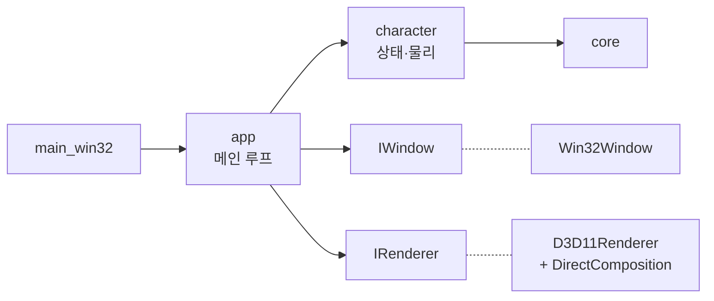

# DeskPet

[](https://github.com/ChoHye0N/TinyDeskPet/actions/workflows/ci.yml)
[](https://github.com/ChoHye0N/TinyDeskPet/actions/workflows/codeql.yml)
[](https://github.com/ChoHye0N/TinyDeskPet/releases)

바탕화면 위에 캐릭터를 띄워 두고 상호작용하는 **가볍고 빠른 Windows 데스크톱 컴패니언**입니다.
게임 엔진 없이 **C++20 + Direct3D 11 + DirectComposition**으로 직접 구현합니다.

> 현재 단계: **M0 기반 구조 (v0.1.0)** — 플레이스홀더 캐릭터로 창·렌더링·상호작용·CI/CD 기반을 완성했습니다. 다음 단계는 [로드맵](docs/06-roadmap/ROADMAP.md)을 보세요.

## 특징

- **투명 배경 + 항상 위 + 클릭 통과** — DirectComposition으로 GPU 안에서 합성해 프레임마다 CPU 복사가 없음 ([ADR-0001](docs/02-architecture/adr/0001-directcomposition-for-transparency.md))
- **드래그 · 낙하 · 점프** — 고정 시간 간격 물리 ([ADR-0004](docs/02-architecture/adr/0004-fixed-timestep-update.md)), 드래그 중에도 애니메이션 유지 ([ADR-0003](docs/02-architecture/adr/0003-manual-window-drag.md))
- **GPU 디바이스 손실 자동 복구** — 드라이버가 리셋되어도 펫이 사라지지 않음
- **테스트 가능한 구조** — 창·렌더러를 인터페이스로 분리해 로직을 Linux CI에서도 테스트 ([ADR-0002](docs/02-architecture/adr/0002-platform-renderer-abstraction.md))
- **CI/CD** — 포맷·정적 분석·새니타이저·CodeQL 검사, 태그 푸시만으로 릴리스 자동 배포

## 구조



자세한 내용은 [아키텍처 설계서](docs/02-architecture/SAD.md)를 보세요.

## 빠른 시작

### 요구 사항

| 도구 | 버전 |
|---|---|
| Windows | 10 (1903 이상) / 11, x64 |
| Visual Studio | 2022 이상, "C++를 사용한 데스크톱 개발" 워크로드 (CMake·Ninja 포함) |
| Python | 3.10 이상 (개발 도구 스크립트용, 선택) |

### Visual Studio에서

1. Visual Studio → **폴더 열기** → 이 저장소 폴더 선택
2. 상단 구성 목록에서 **Windows x64 (MSVC)** 선택 (`CMakePresets.json`을 자동 인식)
3. 시작 항목에서 **DeskPet.exe** 선택 → F5

### 명령줄에서

**x64 Native Tools Command Prompt for VS** (또는 Developer PowerShell)에서:

```bat
cmake --workflow --preset windows-release
```

구성 → 빌드 → 테스트 → zip 패키지까지 한 번에 실행됩니다. 결과물:

- 실행 파일: `build\windows-msvc\bin\Release\DeskPet.exe`
- 배포 zip: `build\windows-msvc\package\DeskPet-0.1.0-win64.zip`

### 조작

| 동작 | 결과 |
|---|---|
| 캐릭터를 끌기 | 이동 |
| 공중에서 놓기 | 바닥(작업 표시줄 위)으로 낙하 |
| 더블클릭 | 점프 |
| 우클릭 | 메뉴 (점프 / 위치 초기화 / 종료) |

설정은 실행 파일 옆의 [`deskpet.ini`](config/deskpet.ini)에서 바꿀 수 있습니다.

## 폴더 구조

```text
deskpet/
├── .github/            CI/CD 워크플로, Dependabot, PR·이슈 템플릿
├── .githooks/          pre-commit 훅 (포맷 검사)
├── assets/             캐릭터 모델 (커밋하지 않음)
├── cmake/              CMake 모듈 (컴파일 옵션, 버전, 패키징)
├── config/             기본 설정 파일 deskpet.ini
├── docs/               설계·운영 문서 ← 여기부터 읽으세요
├── prototypes/         기술 검증용 스파이크 코드 (빌드 제외)
├── scripts/            개발 도구 (포맷, 정적 분석, 버전, 릴리스 노트)
├── src/
│   ├── core/           [플랫폼 독립] 로그, 설정, 시간, 수학, 이벤트
│   ├── character/      [플랫폼 독립] 캐릭터 상태 머신·물리
│   ├── platform/       창 인터페이스 + win32/ 구현
│   ├── renderer/       렌더러 인터페이스 + d3d11/ 구현
│   └── app/            [플랫폼 독립] 메인 루프 + Windows 진입점
├── tests/              단위 테스트 (GoogleTest)
├── CMakeLists.txt
├── CMakePresets.json   빌드 프리셋 (로컬·CI 공용)
└── VERSION             버전의 단일 원천
```

## 문서

| 문서 | 내용 |
|---|---|
| [문서 센터](docs/README.md) | 전체 목록과 읽는 순서 |
| [요구사항 명세서](docs/01-requirements/SRS.md) | 무엇을 만드는가 |
| [아키텍처 설계서](docs/02-architecture/SAD.md) | 어떤 구조로 만드는가 |
| [상세 설계](docs/03-detailed-design/README.md) | 모듈별 인터페이스와 동작 |
| [CI/CD 구현](docs/05-devops/ci-cd-implementation.md) · [사용 가이드](docs/05-devops/ci-cd-usage.md) | 자동화 파이프라인 |
| [로드맵](docs/06-roadmap/ROADMAP.md) | 다음 구현 과제 |
| [기여 가이드](CONTRIBUTING.md) | 브랜치·커밋·PR 규칙 |

## 라이선스

[MIT](LICENSE)
