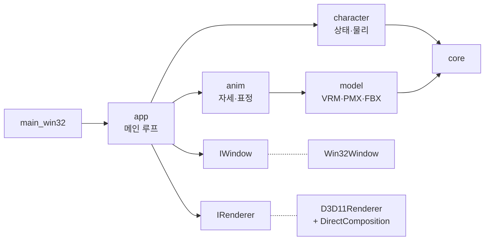

# DeskPet

[](https://github.com/ChoHye0N/TinyDeskPet/actions/workflows/ci.yml)
[](https://github.com/ChoHye0N/TinyDeskPet/actions/workflows/codeql.yml)
[](https://github.com/ChoHye0N/TinyDeskPet/releases)

바탕화면 위에 캐릭터를 띄워 두고 상호작용하는 **가볍고 빠른 Windows 데스크톱 컴패니언**입니다.
게임 엔진 없이 **C++20 + Direct3D 11 + DirectComposition**으로 직접 구현합니다.

> 현재 단계: **M5 진행 중** — VRM·PMX·FBX 모델을 코드 애니메이션(GPU 스키닝·표정)으로 움직이고, MSAA·외곽선까지 적용했습니다. 다음 과제는 [로드맵](docs/06-roadmap/ROADMAP.md)을 보세요.

## 특징

- **투명 배경 + 항상 위 + 픽셀 단위 클릭 통과** — DirectComposition으로 GPU 안에서 합성 ([ADR-0001](docs/02-architecture/adr/0001-directcomposition-for-transparency.md)). 작업 영역 전체를 덮는 오버레이 안에서 캐릭터가 움직이고, 캐릭터가 아닌 픽셀은 클릭이 아래 창으로 감 ([ADR-0011](docs/02-architecture/adr/0011-fullscreen-overlay.md))
- **VRM · PMX · FBX 모델** — 형식별 로더를 하나의 모델 표현으로 통일 ([ADR-0009](docs/02-architecture/adr/0009-multiple-model-formats.md))
- **코드로 만든 애니메이션** — 대기·걷기·매달림·공중·착지 자세, GPU 스키닝, 표정, 상태 전환 slerp 보간 ([ADR-0010](docs/02-architecture/adr/0010-procedural-animation.md))
- **렌더링** — MToon 툰 셰이딩(그림자 색·텍스처, 림, MatCap, 발광)과 선형 색공간 ([ADR-0012](docs/02-architecture/adr/0012-mtoon-linear-color.md)), MSAA, 반전 헐 외곽선 (모델의 MToon·PMX 에지 설정 사용)
- **머리카락·옷 흔들림** — VRM SpringBone. 끌거나 걸으면 관성으로 날리고 다리·팔 충돌체를 피함
- **드래그 · 던지기 · 낙하 · 점프 · 걷기** — 고정 시간 간격 물리 ([ADR-0004](docs/02-architecture/adr/0004-fixed-timestep-update.md)), 드래그 중에도 애니메이션 유지 ([ADR-0003](docs/02-architecture/adr/0003-manual-window-drag.md))
- **크기 조절 · 트레이 아이콘 · 고 DPI · 위치/크기 기억**
- **GPU 디바이스 손실 자동 복구** — 드라이버가 리셋되어도 펫이 사라지지 않음
- **테스트 가능한 구조** — 창·렌더러를 인터페이스로 분리해 로직을 Linux CI에서도 테스트 ([ADR-0002](docs/02-architecture/adr/0002-platform-renderer-abstraction.md))
- **CI/CD** — 포맷·정적 분석·새니타이저·CodeQL 검사, 태그 푸시만으로 릴리스 자동 배포

## 구조



자세한 내용은 [아키텍처 설계서](docs/02-architecture/SAD.md)를 보세요.

## 빠른 시작

### 요구 사항

| 도구 | 버전 |
|---|---|
| Windows | 10 (1903 이상) / 11, x64 |
| Visual Studio | 2022 이상, "C++를 사용한 데스크톱 개발" 워크로드 (CMake·Ninja 포함), 언어 팩 영어 |
| Python | 3.10 이상 (개발 도구 스크립트용, 선택) |

### Visual Studio에서

1. Visual Studio → **폴더 열기** → 이 저장소 폴더 선택
2. 상단 구성 목록에서 **Windows x64 (MSVC)** 선택 (`CMakePresets.json`을 자동 인식)
3. 시작 항목에서 **DeskPet.exe** 선택 → F5

### 명령줄에서

반드시 **x64 Native Tools Command Prompt for VS**에서 (일반 Developer Command Prompt는 32비트라 configure가 멈춤):

```bat
cmake --workflow --preset windows-release
```

구성 → 빌드 → 테스트 → zip 패키지까지 한 번에 실행됩니다. 결과물:

- 실행 파일: `build\windows-msvc\bin\Release\DeskPet.exe`
- 배포 zip: `build\windows-msvc\package\DeskPet-<버전>-win64.zip`

모델 파일은 저장소에 없습니다. `assets/models/`에 넣고 `deskpet.ini`의 `[model] path`로 지정하세요 ([assets/README.md](assets/README.md)). 그 밖의 빌드 방법과 문제 해결은 [기여 가이드](CONTRIBUTING.md)를 보세요.

### 조작

| 동작 | 결과 |
|---|---|
| 캐릭터를 끌기 | 이동 (빠르게 놓으면 던지기) |
| 공중에서 놓기 | 바닥(작업 표시줄 위)으로 낙하 |
| 더블클릭 | 점프 |
| 우클릭 / 트레이 아이콘 | 메뉴 (크기 · 크게 · 작게 / 위치 초기화 / 숨기기 / 종료) |

설정은 실행 파일 옆의 [`deskpet.ini`](config/deskpet.ini)에서 바꿀 수 있습니다.

## 폴더 구조

```text
deskpet/
├── .github/            CI/CD 워크플로, Dependabot, PR·이슈 템플릿
├── .githooks/          pre-commit 훅 (포맷 검사)
├── assets/             캐릭터 모델 (커밋하지 않음)
├── cmake/              CMake 모듈 (컴파일 옵션, 버전, 패키징)
├── config/             기본 설정 파일 deskpet.ini
├── docs/               설계 문서 ← 여기부터 읽으세요
├── prototypes/         기술 검증용 스파이크 코드 (빌드 제외)
├── scripts/            개발 도구 (포맷, 정적 분석, 버전, 릴리스 노트)
├── src/
│   ├── core/           [플랫폼 독립] 로그, 설정, 시간, 수학, 이벤트
│   ├── model/          [플랫폼 독립] VRM·PMX·FBX 로더
│   ├── anim/           [플랫폼 독립] 스켈레톤, 코드 애니메이션
│   ├── character/      [플랫폼 독립] 캐릭터 상태 머신·물리
│   ├── platform/       창 인터페이스 + win32/ 구현
│   ├── renderer/       렌더러 인터페이스 + d3d11/ 구현
│   └── app/            [플랫폼 독립] 메인 루프 + Windows 진입점
├── tests/              단위 테스트 (GoogleTest)
├── CMakeLists.txt
├── CMakePresets.json   빌드 프리셋 (로컬·CI 공용)
└── VERSION             버전의 단일 원천
```

## 문서

| 문서 | 내용 |
|---|---|
| [문서 센터](docs/README.md) | 전체 목록과 읽는 순서 |
| [요구사항 명세서](docs/01-requirements/SRS.md) | 무엇을 만드는가 |
| [아키텍처 설계서](docs/02-architecture/SAD.md) | 어떤 구조로 만드는가 |
| [상세 설계](docs/03-detailed-design/README.md) | 모듈별 인터페이스와 동작 |
| [ADR](docs/02-architecture/adr/README.md) | 주요 결정과 이유 |
| [CI/CD 구현](docs/05-devops/ci-cd-implementation.md) | 자동화 파이프라인 |
| [로드맵](docs/06-roadmap/ROADMAP.md) | 진행 상황과 다음 과제 |
| [학습 노트](docs/07-learning/LEARNING-NOTES.md) | 사용한 기술, 버그와 해결 |
| [기여 가이드](CONTRIBUTING.md) | 빌드, 브랜치·커밋·PR, 릴리스, 문제 해결 |

## 라이선스

[MIT](LICENSE)
