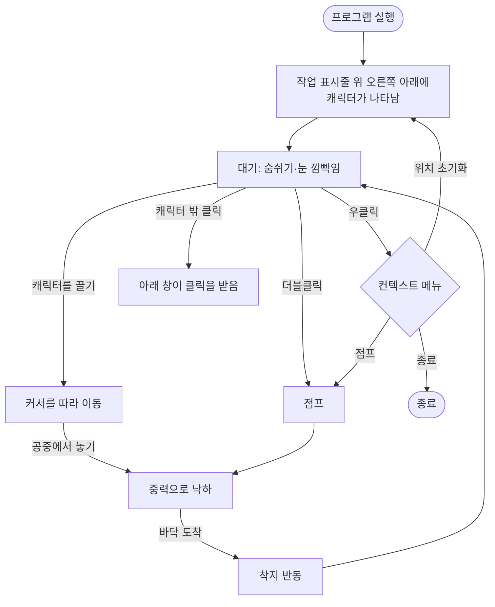

# 소프트웨어 요구사항 명세서 (SRS)

| 항목 | 내용 |
|---|---|
| 문서 ID | DP-SRS-001 |
| 프로젝트 | DeskPet — Windows 데스크톱 컴패니언 |
| 버전 | 0.1.0 |
| 상태 | 승인 (M0 기준선) |
| 작성일 | 2026-10-01 |

### 변경 이력

| 버전 | 날짜 | 내용 |
|---|---|---|
| 0.1.0 | 2026-10-01 | 최초 작성. M0(기반 구조) 범위 확정 |

---

## 1. 개요

### 1.1 목적

이 문서는 DeskPet이 **무엇을 해야 하는지**를 정의합니다. 구현 방법은 [아키텍처 설계서](../02-architecture/SAD.md)와 [상세 설계서](../03-detailed-design/README.md)에서 다룹니다.

### 1.2 제품 비전

> 바탕화면 위에 캐릭터를 띄워 두고 상호작용하는 가볍고 빠른 데스크톱 컴패니언.
> 게임 엔진 없이 **C++20 + Direct3D 11 + DirectComposition**으로 직접 구현하여, 렌더링 파이프라인과 시스템 프로그래밍을 학습하고 포트폴리오로 활용한다.

### 1.3 범위

**포함 (In Scope)**

- Windows 10/11 x64에서 동작하는 단일 실행 파일
- 투명 배경, 항상 위, 작업 표시줄 미표시 창에 캐릭터 렌더링
- 마우스 기반 상호작용 (드래그, 낙하, 점프, 메뉴)
- 최종 목표: VRM 3D 캐릭터 렌더링 (스키닝, 표정, MToon, SpringBone)
- 자동화된 빌드/테스트/패키징/릴리스 (CI/CD)

**제외 (Out of Scope)**

- macOS, Linux 실행 지원 (단, 플랫폼 독립 모듈은 Linux에서 빌드·테스트 가능해야 함 → NFR-PORT-01)
- Live2D 지원 ([ADR-0005](../02-architecture/adr/0005-vrm-over-live2d.md))
- 네트워크 기능, 계정, 클라우드 동기화
- 자동 업데이트 설치 프로그램

### 1.4 용어 정의

| 용어 | 정의 |
|---|---|
| 캐릭터 | 바탕화면에 표시되는 펫. M0에서는 도형으로 그린 플레이스홀더, M3 이후 VRM 모델 |
| 발 위치 (Feet) | 캐릭터의 기준점. 화면 좌표계에서 캐릭터 하단 중앙. 바닥 충돌의 기준 |
| 바닥 (Ground) | 캐릭터가 서 있는 높이. 기본값은 현재 모니터 작업 영역(작업 표시줄 제외)의 하단 |
| 작업 영역 (Work Area) | 모니터 전체 영역에서 작업 표시줄을 뺀 영역 |
| 클릭 통과 (Click-through) | 캐릭터가 없는 투명 영역의 클릭이 아래 창으로 전달되는 동작 |
| DComp | DirectComposition. GPU에서 창 내용을 합성하는 Windows API |
| 디바이스 손실 (Device Lost) | GPU 드라이버 리셋(TDR) 등으로 D3D 디바이스가 무효화되는 상황 |
| VRM | glTF 2.0 기반 3D 휴머노이드 아바타 포맷 |
| 마일스톤 (M0~M6) | [로드맵](../06-roadmap/ROADMAP.md)에 정의된 개발 단계 |

---

## 2. 전체 설명

### 2.1 사용자

| 사용자 | 설명 | 주요 관심사 |
|---|---|---|
| 일반 사용자 | 바탕화면에 펫을 띄워 두는 사람 | 가벼움, 방해되지 않음, 귀여운 반응 |
| 개발자 (본인) | 기능을 추가하고 유지보수하는 사람 | 구조 이해, 빌드 재현성, 테스트 |
| 리뷰어 (면접관) | 포트폴리오로 코드를 보는 사람 | 설계 근거, 코드 품질, 자동화 |

### 2.2 사용 시나리오

### 2.3 운영 환경

| 항목 | 요구 |
|---|---|
| OS | Windows 10 1903 이상, Windows 11 (x64) |
| GPU | Direct3D 11 Feature Level 11.0 이상. 미지원 시 WARP(소프트웨어) 렌더러로 대체 |
| 런타임 | 추가 설치 불필요 (MSVC 런타임 정적 링크) |

### 2.4 설계 제약

- 언어: C++20 / 컴파일러: MSVC (Visual Studio 2022 이상)
- 빌드: CMake 3.25 이상 + CMake Presets
- 그래픽: Direct3D 11, DXGI, Direct2D(디버그·플레이스홀더용), DirectComposition
- 게임 엔진, UI 프레임워크(WPF/Qt/Electron) 사용 금지 — 학습 목적상 직접 구현
- 외부 라이브러리는 헤더 위주의 경량 라이브러리만 허용 (예: cgltf, stb_image, GoogleTest)

---

## 3. 기능 요구사항

우선순위: **M**ust(필수) / **S**hould(권장) / **C**ould(선택)

### 3.1 창 및 표시

| ID | 요구사항 | 우선순위 | 마일스톤 | 검증 |
|---|---|---|---|---|
| FR-01 | 창의 배경은 완전히 투명하며, 캐릭터 픽셀만 보여야 한다 | M | M0 | 수동 테스트 |
| FR-02 | 창은 항상 다른 창 위에 표시되어야 한다 | M | M0 | 수동 테스트 |
| FR-03 | 창은 작업 표시줄과 Alt+Tab 목록에 나타나지 않아야 한다 | M | M0 | 수동 테스트 |
| FR-04 | 캐릭터 영역 밖의 클릭은 아래 창으로 전달되어야 한다 | M | M0 (도형 영역) / M5 (알파 기반) | 수동 테스트 |
| FR-05 | 시작 시 캐릭터는 주 모니터 작업 영역의 오른쪽 아래, 바닥 위에 서 있어야 한다 | M | M0 | 단위 테스트 (App) |
| FR-06 | 메뉴에서 캐릭터 크기를 50% ~ 200%(10% 단위)로 조절할 수 있고, 다음 실행 때 유지되어야 한다 | S | M1 | 단위 테스트 (App) |

### 3.2 상호작용

| ID | 요구사항 | 우선순위 | 마일스톤 | 검증 |
|---|---|---|---|---|
| FR-10 | 캐릭터를 왼쪽 버튼으로 끌면 커서를 따라 이동해야 한다. 이동 중에도 애니메이션은 멈추지 않아야 한다 | M | M0 | 단위 테스트 + 수동 |
| FR-11 | 드래그 판정은 일정 거리(기본 4px) 이상 움직였을 때 시작되어야 한다 (클릭과 구분) | M | M0 | 단위 테스트 |
| FR-12 | 공중에서 놓으면 중력에 따라 바닥까지 낙하해야 한다 | M | M0 | 단위 테스트 |
| FR-13 | 대기 중 더블클릭하면 점프해야 한다 | M | M0 | 단위 테스트 |
| FR-14 | 우클릭 시 컨텍스트 메뉴(크기 / 위치 초기화 / 숨기기 / 종료)를 표시해야 한다. 점프는 더블클릭(FR-13)으로만 | M | M0 | 단위 테스트 (App) |
| FR-15 | 작업 영역이 바뀌면(작업 표시줄 이동, 해상도 변경) 바닥 높이를 다시 계산해야 한다 | S | M0 | 수동 테스트 |
| FR-16 | 놓는 순간의 드래그 속도로 던질 수 있어야 한다 (관성) | S | M1 | 단위 테스트 |
| FR-17 | 캐릭터는 화면(가상 데스크톱) 밖으로 완전히 나가지 않아야 한다 | S | M1 | 단위 테스트 |
| FR-18 | 시스템 트레이 아이콘으로 표시/숨기기/종료할 수 있어야 한다 | S | M1 | 수동 테스트 |
| FR-19 | 프로그램은 동시에 하나만 실행되어야 한다 | C | M1 | 수동 테스트 |

### 3.3 애니메이션 및 캐릭터

| ID | 요구사항 | 우선순위 | 마일스톤 | 검증 |
|---|---|---|---|---|
| FR-20 | 대기 상태에서 숨쉬기와 주기적인 눈 깜빡임을 표현해야 한다 | M | M0 | 단위 테스트 (Pose) |
| FR-21 | 착지 시 짧은 찌그러짐(Squash) 반응을 보여야 한다 | S | M0 | 단위 테스트 |
| FR-22 | VRM 0.x / 1.0 모델 파일을 불러올 수 있어야 한다 | M | M3 | 단위 테스트 (파서) |
| FR-23 | VRM 라이선스 메타데이터를 읽고 사용자에게 표시할 수 있어야 한다 | S | M3 | 수동 테스트 |
| FR-24 | GPU 스키닝으로 휴머노이드 애니메이션을 재생해야 한다 | M | M4 | 수동 + 캡처 |
| FR-25 | VRM 표정(BlendShape/Expression)과 자동 눈 깜빡임을 지원해야 한다 | M | M4 | 수동 |
| FR-26 | MToon 셰이더로 툰 렌더링을 해야 한다 | S | M5 | 캡처 비교 |
| FR-27 | SpringBone으로 머리카락·옷 흔들림을 표현해야 한다 | S | M5 | 수동 |
| FR-28 | 캐릭터가 마우스 커서를 바라봐야 한다 (LookAt) | C | M6 | 수동 |
| FR-29 | 다른 창의 상단 테두리 위를 걸어 다닐 수 있어야 한다 | C | M6 | 수동 |

### 3.4 설정 및 진단

| ID | 요구사항 | 우선순위 | 마일스톤 | 검증 |
|---|---|---|---|---|
| FR-30 | 실행 파일 옆의 `deskpet.ini`에서 설정을 읽어야 한다. 파일이 없거나 값이 잘못되면 기본값을 쓰고 경고를 남겨야 한다 | M | M0 | 단위 테스트 |
| FR-31 | 로그를 레벨(trace~error)별로 남겨야 하며, 레벨은 설정으로 바꿀 수 있어야 한다 | M | M0 | 단위 테스트 |
| FR-32 | 실행 파일에 버전 정보(SemVer + Git 커밋)가 포함되어야 한다 | M | M0 | CI 검증 |
| FR-33 | GPU 디바이스 손실 시 프로그램이 종료되지 않고 렌더링을 복구해야 한다 | M | M0 | 수동 (`dxcap -forcetdr`) |

---

## 4. 비기능 요구사항

> 수치는 **목표값**입니다. 측정 방법과 결과는 마일스톤마다 `docs/06-roadmap/ROADMAP.md`의 측정 기록에 남깁니다.

| ID | 분류 | 요구사항 | 측정 방법 |
|---|---|---|---|
| NFR-PERF-01 | 성능 | 대기 상태 CPU 사용률 평균 1% 미만 (M0 플레이스홀더 기준) | 작업 관리자 / Windows Performance Recorder 60초 평균 |
| NFR-PERF-02 | 성능 | 작업 집합(Working Set) 메모리 M0 기준 50MB 미만, VRM 로드 후 200MB 미만 | 작업 관리자, VMMap |
| NFR-PERF-03 | 성능 | 화면 합성은 GPU에서 처리하고 프레임마다 CPU 메모리로 복사하지 않아야 한다 | 설계 검토 ([ADR-0001](../02-architecture/adr/0001-directcomposition-for-transparency.md)) |
| NFR-PERF-04 | 성능 | 드래그 중 캐릭터가 커서보다 1프레임 이상 늦지 않아야 한다 | 고속 화면 녹화 |
| NFR-REL-01 | 신뢰성 | 디바이스 손실 후 1초 안에 렌더링을 복구해야 한다 | 수동 TDR 테스트 |
| NFR-REL-02 | 신뢰성 | 잘못된 설정 파일이나 모델 파일로 인해 프로그램이 비정상 종료되지 않아야 한다 | 단위 테스트 (퍼징은 선택) |
| NFR-PORT-01 | 이식성 | `core`, `character`, `app` 모듈은 Win32/DirectX 헤더에 의존하지 않아야 하며 Linux(GCC)에서 빌드·테스트되어야 한다 | CI `linux` 잡 |
| NFR-MAINT-01 | 유지보수성 | 플랫폼 독립 모듈의 공개 동작은 단위 테스트로 검증되어야 한다 | CI 테스트 결과 |
| NFR-MAINT-02 | 유지보수성 | CI에서 컴파일러 경고를 오류로 취급해야 한다 | CI 설정 |
| NFR-MAINT-03 | 유지보수성 | 코드는 `.clang-format` 규칙을 따라야 한다 | CI `format` 잡 |
| NFR-SEC-01 | 보안 | 프로그램은 네트워크에 접속하지 않아야 한다 (M6 AI 기능 제외) | 코드 리뷰 |
| NFR-SEC-02 | 보안 | CI는 최소 권한(`contents: read`)으로 실행하고, 릴리스 잡만 쓰기 권한을 가져야 한다 | 워크플로 검토 |
| NFR-USE-01 | 사용성 | 설치 없이 zip 압축을 풀고 바로 실행할 수 있어야 한다 | 릴리스 산출물 확인 |

---

## 5. 요구사항 추적표

요구사항 → 설계 → 구현 → 검증의 연결입니다. 코드 위치는 M0 기준입니다.

| 요구사항 | 설계 문서 | 구현 위치 | 검증 |
|---|---|---|---|
| FR-01, FR-02, FR-03 | [platform.md](../03-detailed-design/platform.md), [renderer.md](../03-detailed-design/renderer.md) | `src/platform/win32/Win32Window.cpp`, `src/renderer/d3d11/D3D11Renderer.cpp` | 수동 |
| FR-04 | [platform.md](../03-detailed-design/platform.md) | `Win32Window::setHitRegionEllipse` | 수동 |
| FR-05, FR-15 | [app.md](../03-detailed-design/app.md) | `Application::resetCharacterPosition` | `tests/app/ApplicationTests.cpp` |
| FR-06 | [app.md](../03-detailed-design/app.md) | `Application::setScalePercent` | `tests/app/ApplicationTests.cpp` |
| FR-10 ~ FR-13 | [character.md](../03-detailed-design/character.md) | `CharacterController` | `tests/character/CharacterControllerTests.cpp` |
| FR-14 | [app.md](../03-detailed-design/app.md) | `Application::onContextMenu` | `tests/app/ApplicationTests.cpp` |
| FR-20, FR-21 | [character.md](../03-detailed-design/character.md) | `CharacterController::pose` | `tests/character/CharacterControllerTests.cpp` |
| FR-30 | [core.md](../03-detailed-design/core.md) | `core/Config.cpp` | `tests/core/ConfigTests.cpp` |
| FR-31 | [core.md](../03-detailed-design/core.md) | `core/Log.cpp` | `tests/core/LogTests.cpp` |
| FR-32 | [ci-cd-implementation.md](../05-devops/ci-cd-implementation.md) | `cmake/Version.h.in`, `cmake/DeskPet.rc.in` | CI `release` 워크플로 |
| FR-33 | [renderer.md](../03-detailed-design/renderer.md) | `D3D11Renderer::handleDeviceLost` | 수동 |
| NFR-PORT-01 | [SAD.md](../02-architecture/SAD.md) §4 | `CMakeLists.txt` 타깃 분리 | CI `linux` 잡 |
| NFR-MAINT-02, 03 | [ci-cd-implementation.md](../05-devops/ci-cd-implementation.md) | `.github/workflows/ci.yml` | CI |

---

## 6. 인수 기준 (M0)

M0는 다음 조건을 모두 만족하면 완료로 봅니다.

1. Windows에서 실행하면 투명 창에 플레이스홀더 캐릭터가 보이고, 숨쉬기와 깜빡임이 재생된다.
2. 드래그, 낙하, 더블클릭 점프, 우클릭 메뉴가 동작한다.
3. 캐릭터 밖을 클릭하면 아래 창이 클릭된다.
4. `main` 브랜치에 푸시하면 CI(Windows 빌드·테스트, Linux 빌드·테스트, 포맷 검사)가 통과한다.
5. `vX.Y.Z` 태그를 푸시하면 zip 패키지가 GitHub Release에 자동으로 올라간다.
