# 소프트웨어 아키텍처 설계서 (SAD)

| 항목 | 내용 |
|---|---|
| 문서 ID | DP-SAD-001 |
| 버전 | 0.1.0 |
| 상태 | 승인 (M0 기준선) |
| 관련 문서 | [SRS](../01-requirements/SRS.md), [ADR 목록](adr/README.md), [상세 설계](../03-detailed-design/README.md) |

### 변경 이력

| 버전 | 날짜 | 내용 |
|---|---|---|
| 0.1.0 | 2026-10-01 | 최초 작성 |
| 0.2.0 | 2026-10-01 | `model` 모듈 추가, MeshPass (ADR-0008) |
| 0.3.0 | 2026-10-01 | M1: 던지기·경계·걷기, 트레이, 단일 인스턴스, DPI, Present 생략, 위치 저장. DEBT-01·02 해소 |
| 0.4.0 | 2026-10-01 | `model` 다중 형식(VRM/glTF, PMX, FBX)과 휴머노이드 본 통일 (ADR-0009) |
| 0.5.0 | 2026-10-01 | `anim` 모듈: 코드로 계산하는 휴머노이드 동작, GPU 스키닝, 표정 (ADR-0010) |

---

## 1. 목적

이 문서는 DeskPet의 **전체 구조**와 그 구조를 선택한 **이유**를 설명합니다. 개별 클래스의 함수 명세는 [상세 설계](../03-detailed-design/README.md)를 참고하세요.

## 2. 아키텍처 목표

품질 속성을 우선순위 순으로 정리했습니다. 설계가 충돌할 때 위쪽 목표를 따릅니다.

| 순위 | 품질 속성 | 의미 | 이를 위한 결정 |
|---|---|---|---|
| 1 | 성능 | 상주 프로그램이므로 CPU·메모리를 거의 쓰지 않아야 함 | DirectComposition 합성, 캐릭터 크기의 작은 창, VSync 동기화 |
| 2 | 테스트 용이성 | 그래픽·OS 없이 로직을 검증할 수 있어야 함 | 플랫폼/렌더러를 인터페이스로 분리하고 의존성 주입 |
| 3 | 이식성 | 나중에 macOS(Metal) 백엔드를 추가할 수 있어야 함 | 플랫폼 독립 모듈은 Win32 헤더 금지 |
| 4 | 확장성 | 플레이스홀더 → VRM 3D로 바꿀 때 상위 코드 변경 최소화 | 렌더 패스 구조, 렌더러는 `RenderScene` 데이터만 받음 |
| 5 | 학습 가치 | DirectX 파이프라인을 직접 다룸 | 엔진·UI 프레임워크 미사용 |

## 3. 시스템 컨텍스트

DeskPet과 외부 요소의 관계입니다 (C4 모델 Level 1).

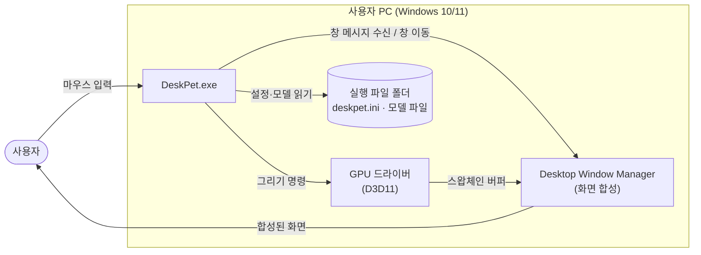

## 4. 논리 구조: 레이어와 모듈

### 4.1 레이어 다이어그램

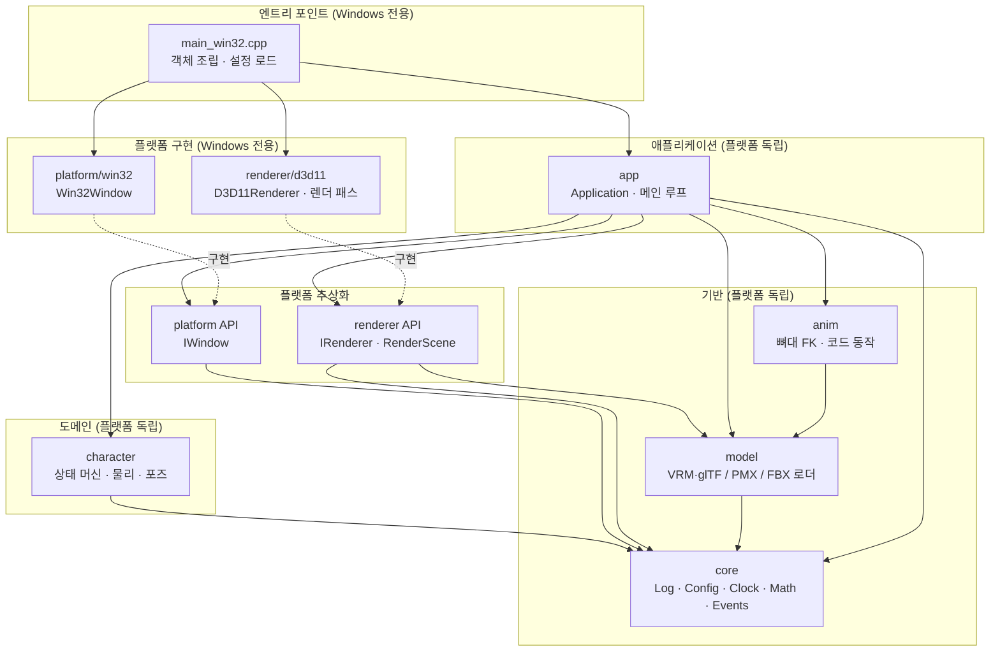

### 4.2 의존성 규칙

| 규칙 | 설명 | 강제 방법 |
|---|---|---|
| R1 | 화살표 방향으로만 의존한다. 하위 레이어는 상위를 모른다 | CMake 타깃 링크 관계 |
| R2 | `core`, `model`, `anim`, `character`, `app`은 `<windows.h>`나 DirectX 헤더를 include 하지 않는다 | Linux CI 빌드가 실패하므로 자동 검출 |
| R3 | `character`는 렌더러를 모른다. 렌더러도 `character`를 모른다. 둘 사이 변환은 `app`이 한다 | 타깃 링크 관계 |
| R4 | 구체 클래스(`Win32Window`, `D3D11Renderer`)를 아는 곳은 `main_win32.cpp` 하나뿐이다 | 코드 리뷰 |

> **왜 R3인가?** 캐릭터 로직(도메인)은 "어디에 있고 어떤 자세인가"만 알면 되고, "어떻게 그리는가"는 렌더러의 일입니다. 둘을 분리하면 플레이스홀더에서 VRM으로 렌더러를 바꿔도 캐릭터 로직과 그 테스트는 그대로 둘 수 있습니다.

### 4.3 모듈 책임

| 모듈 | 책임 | 하지 않는 일 |
|---|---|---|
| `core` | 로그, 설정 파싱, 시간, 수학 타입, 입력 이벤트 정의, 고정 시간 간격 계산 | OS 호출(파일 읽기 제외), 그래픽 |
| `model` | VRM·glTF / PMX / FBX 파일 → 공통 규약의 렌더링용 데이터(정점·인덱스·머티리얼·텍스처·본), 바인드 포즈 굽기, 휴머노이드 본 이름 통일 (ADR-0009) | GPU 업로드, PNG/JPEG 디코딩 |
| `anim` | 휴머노이드 본 회전(상태별 코드 동작)·FK·스킨 행렬·표정 가중치 (ADR-0010) | 캐릭터 상태 결정, GPU 업로드 |
| `character` | 캐릭터 상태(대기/드래그/공중), 위치·속도, 중력, 애니메이션용 포즈 값 계산 | 창 이동, 그리기 |
| `platform` (API) | 창 생성, 이벤트 수집, 창 위치·클릭 영역·메뉴, 작업 영역 조회를 **인터페이스로** 정의 | 구현 |
| `platform/win32` | 위 인터페이스를 Win32로 구현 | 게임 로직 |
| `renderer` (API) | 렌더러 인터페이스와 렌더링 입력 데이터(`RenderScene`) 정의 | 구현 |
| `renderer/d3d11` | D3D11 + DXGI + DComp로 투명 스왑체인 생성, 렌더 패스 실행, 디바이스 손실 복구 | 캐릭터 로직 |
| `app` | 메인 루프, 이벤트 분배, 도메인 ↔ 창 ↔ 렌더러 사이 데이터 변환, 메뉴 처리 | OS·그래픽 API 직접 호출 |

## 5. 컴포넌트 구조

핵심 타입 관계입니다. 전체 멤버는 [상세 설계](../03-detailed-design/README.md)에 있습니다.

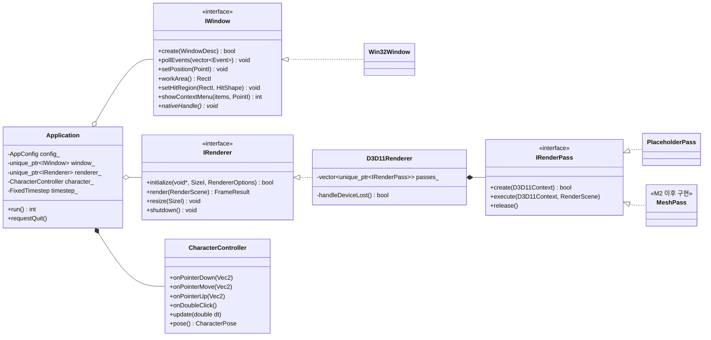

## 6. 런타임 구조

### 6.1 스레딩 모델

M0는 **단일 스레드**입니다. 하나의 스레드가 메시지 처리 → 업데이트 → 렌더링 → Present를 반복합니다.

- 이유: Win32 창은 생성한 스레드에서만 메시지를 받고, D3D11 즉시 컨텍스트는 스레드 안전하지 않습니다. 작은 펫 하나에 멀티스레드는 복잡도 대비 이득이 없습니다.
- 확장 계획: M3에서 VRM/텍스처 로딩을 **작업 스레드**로 분리합니다. 로딩 결과는 큐로 메인 스레드에 넘기고, GPU 리소스 생성은 메인 스레드에서 합니다 (ID3D11Device는 스레드 안전하므로 작업 스레드에서 생성하는 것도 선택 가능).

### 6.2 시작 시퀀스

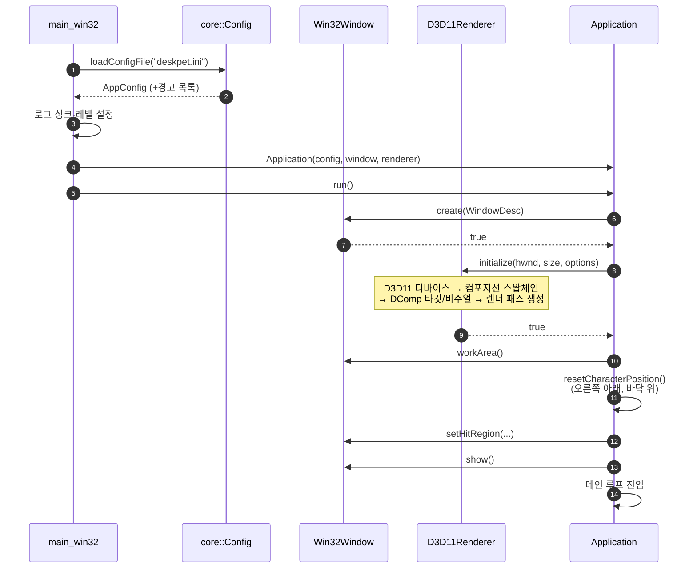

### 6.3 프레임 루프

한 프레임의 처리 순서입니다. 업데이트는 **고정 시간 간격(60Hz)**, 렌더링은 **모니터 주사율(VSync)**에 맞춥니다 ([ADR-0004](adr/0004-fixed-timestep-update.md)).

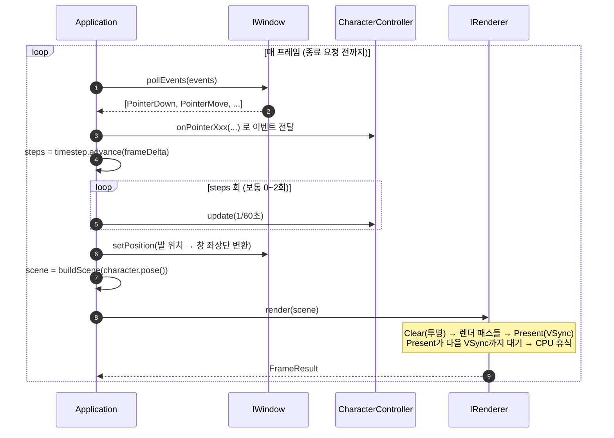

### 6.4 드래그 → 낙하 시나리오

`HTCAPTION`을 이용한 OS 기본 창 드래그는 드래그하는 동안 메인 루프를 멈추게 합니다(모달 루프). 그래서 드래그를 **직접 구현**합니다 ([ADR-0003](adr/0003-manual-window-drag.md)).

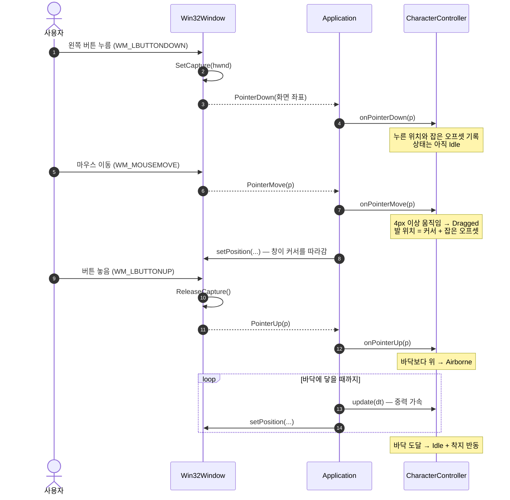

### 6.5 캐릭터 상태 머신

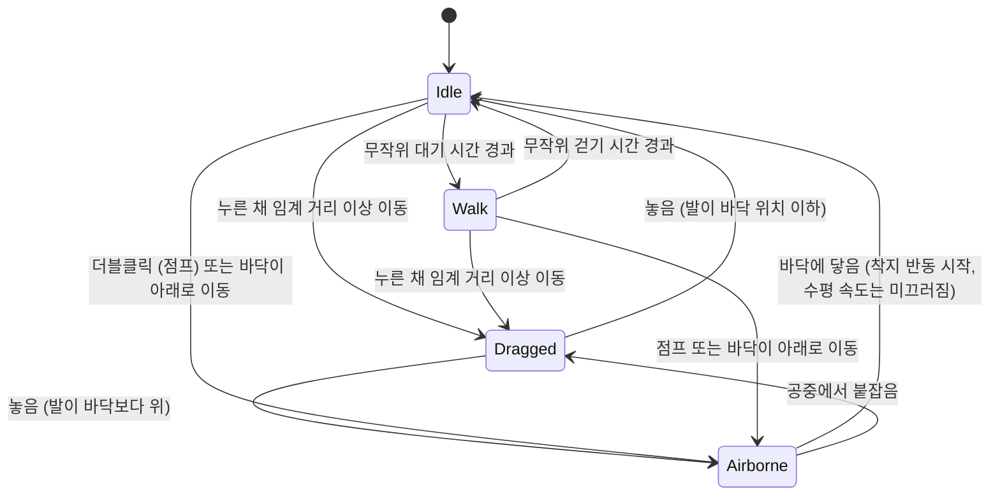

놓는 순간 최근 드래그 속도로 던져지고(FR-16), 발 x는 가상 데스크톱 안에 머뭅니다(FR-17). 자세한 규칙: [character.md](../03-detailed-design/character.md) §4

### 6.6 GPU 디바이스 손실 복구

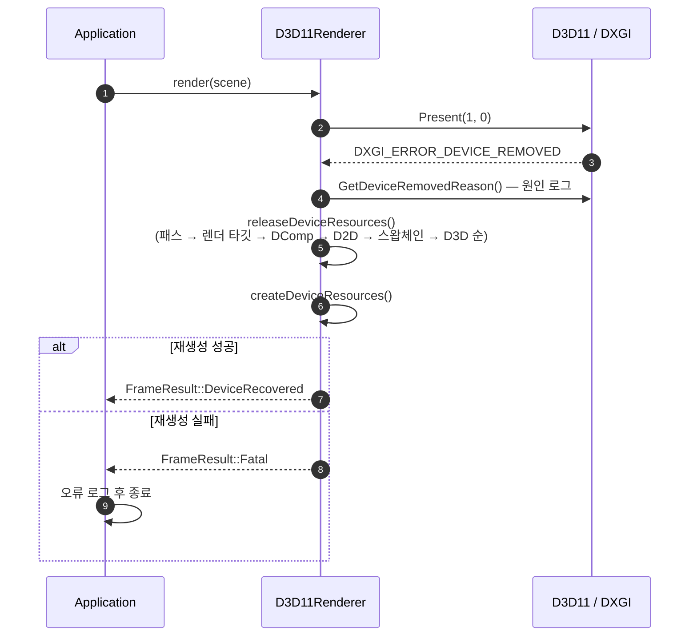

## 7. 렌더링 아키텍처

### 7.1 투명 창 합성 경로

레이어드 윈도우(`UpdateLayeredWindow`)는 매 프레임 GPU 결과를 CPU 메모리로 복사합니다. DeskPet은 DirectComposition으로 **GPU 안에서** 합성합니다 ([ADR-0001](adr/0001-directcomposition-for-transparency.md)).

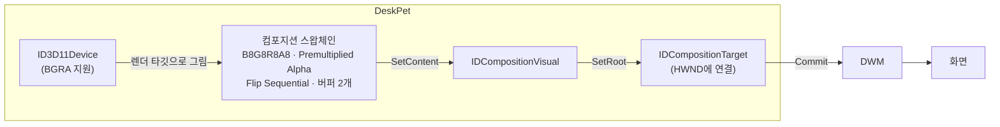

핵심 조건 세 가지:

1. 창은 `WS_EX_NOREDIRECTIONBITMAP` 스타일로 만들어 GDI용 비트맵을 만들지 않는다.
2. 스왑체인은 `CreateSwapChainForComposition`으로 만들고 `DXGI_ALPHA_MODE_PREMULTIPLIED`를 쓴다.
3. 모든 픽셀 출력은 **premultiplied alpha**여야 한다 (RGB에 이미 알파가 곱해진 값). 셰이더를 직접 작성할 때 반드시 지킨다.

### 7.2 렌더 패스 구조

렌더러는 등록된 패스를 순서대로 실행합니다. M0에는 `PlaceholderPass` 하나만 있습니다.

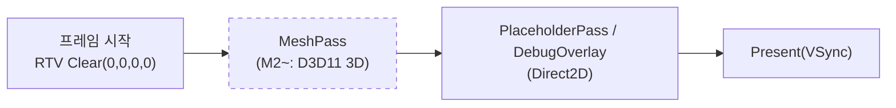

- 3D 패스(D3D11)를 먼저, 2D 오버레이(Direct2D)를 나중에 그립니다. 두 API는 같은 D3D11 디바이스와 백버퍼를 공유합니다.
- 패스는 디바이스 종속 리소스를 가지므로 디바이스 손실 시 `release()` → `create()`로 다시 만들어집니다.

## 8. 좌표계

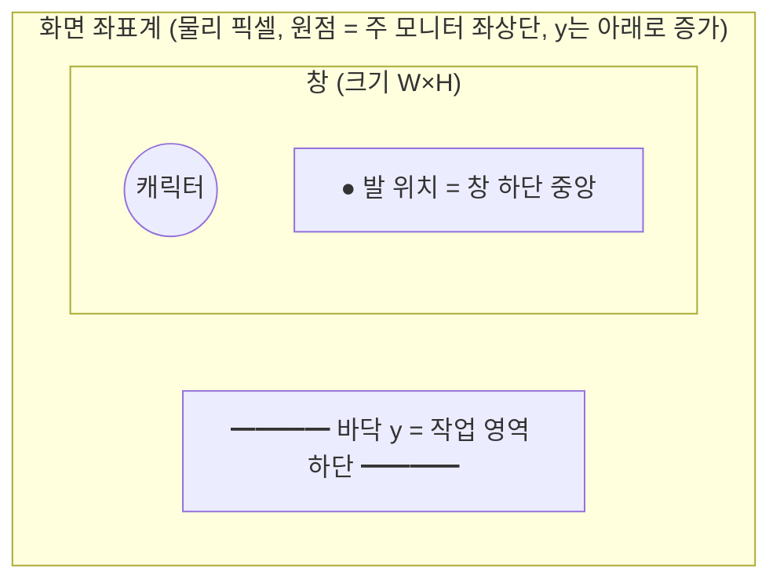

| 값 | 좌표계 | 소유자 |
|---|---|---|
| 캐릭터 발 위치 (`CharacterController::position`) | 화면 좌표, float | character |
| 창 좌상단 | 화면 좌표, int | platform |
| 렌더링 좌표 (`RenderScene`) | 창 내부 좌표 (0,0 = 창 좌상단) | renderer |

변환 규칙: `창 좌상단 = (round(발.x − W/2), round(발.y − H))`. 이 변환은 `app`이 담당합니다.

- 프로세스는 **Per-Monitor DPI Aware V2**로 실행되어 모든 좌표가 물리 픽셀입니다. 고해상도 모니터에서 캐릭터 크기 보정은 M1 과제입니다.

## 9. 오류 처리와 로깅 정책

| 상황 | 처리 |
|---|---|
| 초기화 실패 (창, 디바이스 생성) | `bool` 반환 + `error` 로그 → `main`이 메시지 박스로 알리고 종료 코드 1 |
| HRESULT 실패 | `d3d11::check(hr, "설명")`으로 로그(호출 위치 포함) 후 `false` 반환 |
| 디바이스 손실 | 복구 시도 (§6.6) |
| 설정 값 오류 | 기본값 사용 + `warn` 로그 (프로그램 계속) |
| 프로그래밍 오류 (불변식 위반) | `assert` (Debug 빌드에서만) |
| 예외 | 표준 라이브러리 예외(`bad_alloc` 등)만 `main`에서 최종 포착. 우리 코드는 예외를 던지지 않음 |

로그는 `core::logging`을 통해 남기며, 출력 대상(싱크)은 `main`이 결정합니다. Windows에서는 `OutputDebugString`(Visual Studio 출력 창)과 `deskpet.log` 파일에 씁니다.

## 10. 빌드 구조

CMake 타깃 의존 그래프입니다. 점선 타깃은 Windows에서만 빌드됩니다.

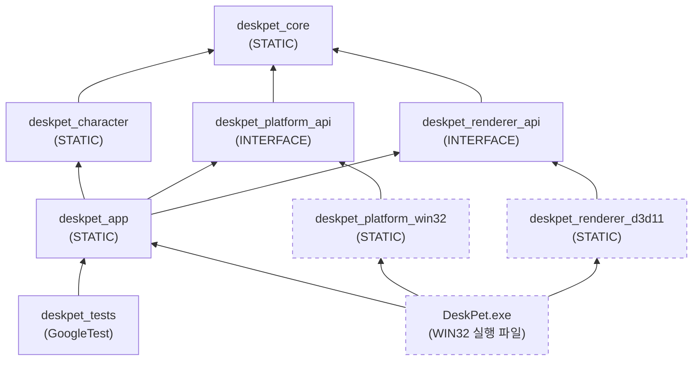

## 11. 배포 구조

릴리스 산출물은 설치가 필요 없는 zip입니다 (NFR-USE-01).

```
DeskPet-0.1.0-win64.zip
└── DeskPet-0.1.0-win64/
    ├── bin/
    │   ├── DeskPet.exe        ← 버전 정보 리소스 포함, MSVC 런타임 정적 링크
    │   └── deskpet.ini        ← 기본 설정 (주석 포함)
    ├── README.md
    ├── CHANGELOG.md
    └── LICENSE
```

빌드부터 배포까지의 자동화는 [CI/CD 구현 문서](../05-devops/ci-cd-implementation.md)를 참고하세요.

## 12. 위험 요소와 기술 부채

| ID | 위험 / 부채 | 영향 | 대응 |
|---|---|---|---|
| RISK-01 | GPU 드라이버 리셋 시 DComp 창이 사라짐 | 펫이 조용히 사라짐 | 디바이스 손실 복구 구현 (FR-33) |
| RISK-02 | `SetWindowRgn`의 도형 영역은 캐릭터 실루엣과 정확히 일치하지 않음 | 모서리 클릭이 통과/차단 오차 | M5에서 알파 기반 히트 테스트로 교체 |
| RISK-03 | 단일 스레드에서 큰 VRM 로딩 시 프레임 멈춤 | 시작 시 잠깐 멈춤 | M3에서 작업 스레드 로딩 |
| RISK-04 | Direct3D 디버그 레이어는 "그래픽 도구" 선택적 기능이 설치되어야 동작 | Debug 빌드 디바이스 생성 실패 | 디버그 플래그 실패 시 플래그 없이 재시도 |
| ~~DEBT-01~~ | ✅ 해소 (M1): 창 크기 × DPI 배율, `WM_DPICHANGED` 처리 | 사용성 | — |
| ~~DEBT-02~~ | ✅ 해소 (M1): 장면이 같으면 Present 생략 + 이벤트 대기 | 전력 소모 | — |

## 13. 아키텍처 의사결정 기록

| ADR | 제목 |
|---|---|
| [0001](adr/0001-directcomposition-for-transparency.md) | 투명 창 합성에 DirectComposition 사용 |
| [0002](adr/0002-platform-renderer-abstraction.md) | 플랫폼·렌더러 인터페이스 분리와 의존성 주입 |
| [0003](adr/0003-manual-window-drag.md) | OS 기본 창 드래그 대신 직접 드래그 구현 |
| [0004](adr/0004-fixed-timestep-update.md) | 고정 시간 간격 업데이트 |
| [0005](adr/0005-vrm-over-live2d.md) | 캐릭터 포맷으로 VRM 채택 |
| [0006](adr/0006-cmake-presets-ninja.md) | CMake Presets + Ninja Multi-Config 빌드 |
| [0007](adr/0007-github-actions-ci.md) | GitHub Actions 기반 CI/CD, Linux에서 이식 가능 모듈 검증 |
