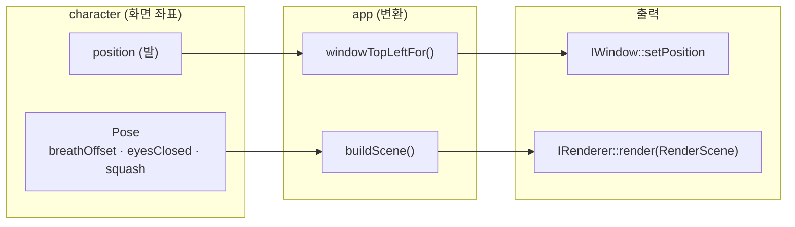

# app 모듈 상세 설계

| 항목 | 내용 |
|---|---|
| CMake 타깃 | `deskpet_app` (STATIC, 플랫폼 독립), `DeskPet` (WIN32 실행 파일) |
| 네임스페이스 | `deskpet::app` |
| 의존 | `deskpet_character`, `deskpet_platform_api`, `deskpet_renderer_api` (+ 실행 파일은 Win32/D3D11 구현) |
| 관련 요구사항 | FR-05, FR-13, FR-14, FR-15, FR-30, FR-31 |

## 1. 책임

모든 모듈을 **연결**하고 메인 루프를 돌립니다.

- 하는 일: 초기화 순서 관리, 이벤트 분배, 고정 시간 간격 업데이트, 캐릭터 위치 → 창 위치 변환, 캐릭터 포즈 → `RenderScene` 변환, 메뉴 구성과 명령 처리, 종료 코드 결정
- 하지 않는 일: OS·그래픽 API 직접 호출. 구체 클래스 생성 (→ `main_win32.cpp`)

## 2. 파일 구성

| 파일 | 역할 |
|---|---|
| `src/app/Application.h/.cpp` | 메인 루프 (플랫폼 독립, 테스트 대상) |
| `src/app/CameraFit.h/.cpp` | 모델 경계 상자를 창에 맞추는 카메라 (§4.7) |
| `src/app/main_win32.cpp` | Windows 진입점 (`wWinMain`): 설정·로그 준비, 구체 객체 조립 |
| `src/app/win32/DeskPet.manifest` | DPI 인식(PerMonitorV2), UTF-8 코드 페이지, 지원 OS 선언 |
| `cmake/DeskPet.rc.in` | 실행 파일 버전 정보 리소스 템플릿 |

## 3. 공개 인터페이스

```cpp
namespace deskpet::app {

enum class MenuCommand : std::uint8_t {
    About = 1, /* 2: 예전 Jump */ ResetPosition = 3, Quit = 4, ToggleVisible = 5,
    ScaleInfo = 6, ScaleUp = 7, ScaleDown = 8,
};

enum class ExitCode : std::uint8_t {
    Ok = 0, InitializationFailed = 1, RendererFailed = 2,
    UnhandledException = 3,   // main_win32.cpp 최상위 예외 처리
};

class Application {
public:
    Application(core::AppConfig config,
                std::unique_ptr<platform::IWindow> window,
                std::unique_ptr<renderer::IRenderer> renderer,
                core::TimeSource timeSource = core::makeSteadyTimeSource());
    ~Application();

    [[nodiscard]] int run();     // 초기화 → 루프 → 정리. 종료 코드 반환
    void requestQuit() noexcept;
    void setModel(std::shared_ptr<const model::Model> model);  // run() 전. 있으면 슬라임 대신 표시

    [[nodiscard]] const character::CharacterController& character() const noexcept;
};
}
```

## 4. 동작 명세

### 4.1 초기화 (`initialize`)

| 순서 | 동작 | 실패 시 |
|---|---|---|
| 1 | `window->create({title, size, position=(0,0), alwaysOnTop})` | `InitializationFailed` |
| 2 | `dpiScale = window->dpiScale()`. 1이 아니면 `창 크기 = 설정 × 배율`로 `setSize`, 카메라 재계산 (DEBT-01) | — |
| 3 | `renderer->initialize(window->nativeHandle(), 창 크기, options)` | `InitializationFailed` |
| 4 | `refreshBounds()` → 저장된 위치 복원(§4.8), 없거나 화면 밖이면 `resetCharacterPosition()` | — |
| 5 | `applyHitRegion()` — 슬라임 타원 / 모델 사각형(+외곽선 여유 3px) | — |
| 6 | `window->show()`, `showTrayIcon("DeskPet")`(실패해도 계속), 시간 기준점 기록 | — |

### 4.2 메인 루프 (`tick`, 한 프레임)

```text
events.clear(); window.pollEvents(events)
for event in events: handleEvent(event)
if quitRequested: break
if hidden: window.waitForEvents(100ms); lastTime = now; continue   # 숨김: 갱신·렌더링 없음

now = timeSource(); delta = now - lastTime; lastTime = now
steps = timestep.advance(delta)
if character.state != Dragged: refreshGround()   # 걷기·던지기로 다른 모니터에 넘어갔을 수 있음
repeat steps: character.update(timestep.step())

syncWindowToCharacter()
updateAnimation()   # 캐릭터 Pose → anim::AnimationInput → 스킨 행렬·표정 (모델이 있을 때)
result = renderer.render(buildScene())
if result == Skipped: window.waitForEvents(16ms)  # Present 생략 → VSync 대기 없음 (DEBT-02)
if result == Fatal: exitCode = RendererFailed; break
```

### 4.3 이벤트 처리

| 이벤트 | 처리 |
|---|---|
| `PointerDownEvent{Left}` | `character.onPointerDown(screen)` |
| `PointerMoveEvent` | `character.onPointerMove(screen)` |
| `PointerUpEvent{Left}` | `refreshGround()` 후 `character.onPointerUp(screen)` — 다른 모니터에 놓았을 때 그 모니터의 바닥 사용 |
| `PointerUpEvent{Right}` | `onContextMenu(screen)` |
| `DoubleClickEvent{Left}` | `character.jump()` |
| `WorkAreaChangedEvent` | `refreshGround()`, `refreshBounds()` — 이후 `update`가 낙하/보정 처리 |
| `QuitRequestedEvent` | `requestQuit()` |
| `TrayMenuRequestedEvent` | `onContextMenu(screen)` — 캐릭터 우클릭과 같은 메뉴 (FR-18) |
| `DpiChangedEvent` | 창 크기 = 설정 × 배율 → `setSize`, `renderer.resize`, 카메라·경계·히트 영역 재계산, 발 위치 기준으로 창 재배치 |

### 4.4 컨텍스트 메뉴

| id | 라벨 | 활성 조건 | 동작 |
|---|---|---|---|
| `About` | `DeskPet 0.1.0` (버전 문자열) | 항상 비활성 (정보 표시용) | — |
| — | 구분선 | | |
| `ScaleInfo` | `크기 100%` (현재 크기) | 항상 비활성 (정보 표시용) | — |
| `ScaleUp` | 크게 | 200% 미만 | `setScalePercent(+10)` (FR-06) |
| `ScaleDown` | 작게 | 50% 초과 | `setScalePercent(−10)` |
| — | 구분선 | | |
| `ResetPosition` | 위치 초기화 | 항상 | `resetCharacterPosition()` |
| `ToggleVisible` | 숨기기 / 보이기 | 항상 | `window.hide()/show()`. 숨김 중에는 트레이 메뉴로만 되돌릴 수 있음 |
| — | 구분선 | | |
| `Quit` | 종료 | 항상 | `requestQuit()` |

메뉴에서 점프는 뺐습니다 (더블클릭으로만, FR-13). 메뉴 id 2(예전 `Jump`)는 비워 둡니다.

**크기 조절 (FR-06)**: 50% ~ 200%, 10% 단위. 바뀌면 `resizeWindow()`가 DPI 변경과 같은 경로로 창·렌더러·카메라·벽·클릭 영역을 갱신하고, 발 위치를 기준으로 창을 다시 놓아 캐릭터가 같은 자리에 서 있습니다. 종료할 때 `[state] scale`로 저장하고, 시작할 때 10% 단위·범위로 맞춰 복원합니다.

### 4.5 좌표 변환

창 크기를 `W × H`, 캐릭터 발 위치를 `F`라 할 때

| 변환 | 공식 |
|---|---|
| 발 → 창 좌상단 | `(round(F.x − W/2), round(F.y − H))` |
| 시작 위치 (발) | `(workArea.right − marginRight × 배율 − W/2, workArea.bottom)` |
| 발 x 범위 (FR-17) | `[desktop.left + (W/2 − hit.left), desktop.right − (hit.right − W/2)]` — **그려지는 영역**(`hitRegion`, 모델 경계 상자 투영)이 가상 데스크톱 안에 머묾. 창 반폭으로 막으면 모델 바깥의 투명한 여백 때문에 화면 끝 앞에서 멈춰 보이므로, 창의 투명한 부분은 화면 밖으로 나가도 됨. 모델·DPI가 바뀌면 다시 계산 |
| 창 크기 `W × H` | 설정 크기 × DPI 배율 × 사용자 크기(%) (물리 px). 슬라임·모델 모두 창에 맞춰 그리므로 창 크기만 바꾸면 캐릭터 크기가 바뀜. 물리 상수(중력 등)는 배율과 무관 |
| 바닥 | `workArea.bottom` |

플레이스홀더 캐릭터 (창 내부 좌표)

| 값 | 공식 |
|---|---|
| 기본 반지름 | `U = min(W, H)`일 때 `rx = 0.32 × U`, `ry = 0.27 × U` (세로로 긴 창에서도 비율 유지) |
| 착지 반동 반영 | `ry' = ry × (1 − squash)`, `rx' = rx × (1 + 0.5 × squash)` |
| 중심 | `(W/2, H − footMargin − ry' + breathOffset)`, `footMargin = 4px` |
| 클릭 영역 | 기본 타원을 숨쉬기 진폭 + 2px만큼 키운 사각형 |



모델이 있을 때 (ADR-0008)

| 값 | 공식 |
|---|---|
| 슬라임 | `placeholder.visible = false` |
| 애니메이션 (ADR-0010) | 상태 매핑 Idle/Walk/Dragged/Airborne → `anim::Motion`, `time`·`squash`·`blink`(= 눈 감음)·`idleMotion`(설정)을 넘겨 `ProceduralAnimator::evaluate`. 결과 스킨 행렬·표정 가중치를 `scene.character`에 복사 |
| 카메라·클릭 영역 기준 | `displayBounds()` — 대기·매달림·공중 자세를 합친 경계 상자 (T포즈 폭 대신) |
| 숨긴 슬라임 | 모델이 있으면 `placeholder`를 기본값으로 고정 — 숨쉬기 값이 바뀌면 장면 비교가 항상 "다름"이 되어 Present 생략이 안 됨 |
| 뷰×투영 | `rotationY(turn) × squash × camera`. `turn`은 목표 `facing × 50°`로 **일정한 속도(50° / 0.2초)로 돌아감** (`core::moveTowards`, 즉시 바꾸면 튀어 보임. 방향을 바꾸면 정면을 지나 0.4초). 경계 상자는 `displayBounds(50°)`로 돌린 몸까지 포함. squash = 발(y=0) 기준 `scale(1 + 0.5s, 1 − s, 1 + 0.5s)`. 걷는 방향으로 몸을 돌리되 얼굴이 보이도록 50°만 |
| 클릭 영역 | 경계 상자 8개 꼭짓점을 화면에 투영한 사각형(창 안으로 자름)에 내접하는 타원 |

### 4.6 Windows 진입점 (`main_win32.cpp`)

1. 실행 파일 폴더를 구함 (`GetModuleFileNameW`)
2. `deskpet.ini` 로드 → 경고는 로그 준비 후 출력
3. 로그 레벨 설정, 싱크 = `OutputDebugStringW` + (설정 시) `deskpet.log`
4. 버전·Git 해시 로그
5. COM 초기화 (`CoInitializeEx`, WIC 텍스처 디코딩용. `Application`보다 오래 살도록 먼저 선언)
6. `Win32Window`, `D3D11Renderer` 생성 → `Application`에 주입
7. `[model] path`가 있으면 `loadModelFile` → 성공 시 `setModel`, 실패 시 경고 로그 후 슬라임 → `run()`
8. 종료 코드가 0이 아니면 메시지 박스로 로그 파일 위치 안내
9. 표준 예외는 최상위에서 잡아 로그 + 메시지 박스

빌드할 때마다 `config/deskpet.ini`와 `assets/models/`를 실행 파일 옆으로 복사합니다 (`deskpet_copy_runtime_files` 타깃. POST_BUILD는 재링크될 때만 실행되어 ini·모델만 바뀐 경우를 놓침).

진입점 추가 동작

| 동작 | 내용 |
|---|---|
| 단일 인스턴스 (FR-19) | 설정·로그보다 먼저 `CreateMutexW("Local\\DeskPet.SingleInstance")`. `ERROR_ALREADY_EXISTS`면 조용히 0으로 종료 (두 번째 실행이 첫 실행의 로그를 밀어내지 않도록 로그보다 먼저) |
| 로그 | `core::LogFile` — 이전 실행 로그는 `deskpet.log.1`, 4MB 한도 |
| 마지막 위치 저장 | 종료 코드 0이면 `[state] last_x = 발 x, last_y = 바닥` 을 `deskpet.ini`에 기록 (`core::saveConfigValues`, 주석 유지). 공중에서 종료해도 높이는 바닥으로 |

### 4.7 카메라 맞춤 (`fitCameraToBounds`)

정면(+Z)에서 바라보는 원근 카메라. 화각 20°(망원이라 원근 왜곡이 적음), 위·옆 여백 2%, **아래 여백 0**.

기준은 **발 = 모델 원점(x = 0, z = 0)**입니다. 이 평면에서 화면 반높이 `H`, 거리 `D = H / tan(10°)`, 앞으로 나온 깊이 `f = max(max.z, 0)`, 여백을 뺀 범위 `u = 0.98`, 가로 반폭 `w = max(−min.x, max.x)`.

1. 앞으로 f만큼 나온 점은 `D / (D − f)`배 커 보이므로, 축에서 a 떨어진 점이 들어오려면 `a ≤ u·(H − f·tan)`
2. `H = max((높이 + u·f·tan) / (1 + u), w ÷ (화면비·u) + f·tan)`
3. 시선 `(0, min.y + H, D)` → 발바닥(min.y)이 화면 맨 아래(창 바닥 = 작업 표시줄 위), 발(x = 0)이 화면 가로 가운데
4. near = (D − f) / 2, far = 2·(D − min(min.z, 0))

- **가로 가운데를 발에 맞추는 이유**: 앱은 발 = 창 가로 중앙으로 보고 창 위치·벽을 계산합니다. 상자 중앙에 맞추면 한쪽으로 치우친 모델(비대칭 꼬리, 한 손 소품)이 밀려 그려져 화면 끝과 어긋납니다. 대신 넓은 쪽 반폭으로 좌우 대칭으로 맞춥니다.
- **아래 여백 0**: 여백이 있으면 발이 작업 표시줄에서 몇 px 떠 보입니다.
- 예전에는 상자 **앞면**(z = max.z)에 발을 맞췄습니다. 걷기 회전까지 담아 상자가 앞뒤로 깊어지자 z = 0의 실제 발이 원근 때문에 위로 떠 보였습니다. 상자 앞쪽 바닥 모서리는 실제 정점이 아니라 빈 구석이라 화면 아래로 나가도 됩니다.

### 4.8 마지막 위치 복원

1. `config.state.lastPosition()`이 없으면 기본 위치
2. 가상 데스크톱 밖(`x ∉ [left, right)`, `y ∉ (top, bottom]`)이면 기본 위치 (모니터 분리·해상도 변경 대비)
3. 그 위치로 `teleport` → 창을 옮김 → 그 모니터의 바닥으로 `refreshGround` → 다시 `teleport` (바닥보다 위면 낙하)

DPI 인식은 코드(`SetProcessDpiAwarenessContext`)가 아니라 **매니페스트**로 선언합니다. 매니페스트 방식은 프로세스 시작 전에 적용되므로 Microsoft가 권장하는 방법입니다.

## 5. 테스트 항목

`tests/app/ApplicationTests.cpp` — `FakeWindow`, `FakeRenderer`, 가짜 시간으로 메인 루프를 검증합니다.

| 테스트 | 요구사항 |
|---|---|
| 창 생성 실패 시 `InitializationFailed` 반환, 렌더러 초기화 안 함 | — |
| 렌더러 초기화 실패 시 `InitializationFailed` | — |
| 시작 시 창이 작업 영역 오른쪽 아래, 바닥에 맞춰 배치됨 | FR-05 |
| `QuitRequestedEvent` 수신 시 루프 종료, `Ok` 반환 | — |
| 드래그 이벤트 시퀀스에 따라 창 위치가 커서를 따라감 | FR-10 |
| 우클릭 → 메뉴 표시, "종료" 선택 시 루프 종료 | FR-14 |
| 렌더러가 `Fatal` 반환 시 `RendererFailed` | FR-33 |
| 작업 영역 변경 이벤트 후 캐릭터가 새 바닥으로 이동 | FR-15 |
| 모델 없음 → 슬라임만, 모델 있음 → 슬라임 숨김·모델 포인터 전달·발이 화면 아래 가운데 | ADR-0008 |
| 모델 있음 → 클릭 영역이 투영된 모델을 덮음 | ADR-0008 |
| `CameraFitTests`: 꼭짓점이 화면·깊이 범위 안(앞쪽 바닥 모서리 제외), 제한 축이 꽉 참, 깊은·치우친 모델도 발이 화면 맨 아래 가로 가운데 | ADR-0008 |
| 시작 시 트레이 아이콘, 트레이 메뉴가 캐릭터 메뉴와 같은 항목, 숨기기 중 렌더링 없음·대기, 다시 보이기 | FR-18 |
| 시작 DPI 배율로 창·렌더러 크기 확대, DPI 변경 시 크기·렌더러·히트 영역 갱신(화면 끝이면 안쪽으로) | DEBT-01 |
| 화면 왼쪽·오른쪽 밖으로 끌어 놓으면 그려지는 영역의 끝이 모니터 끝에 맞음 (창 여백은 밖으로 나감) | FR-17 |
| `Skipped` 프레임마다 `waitForEvents` 호출 | DEBT-02 |
| 저장 위치 복원 후 바닥으로 낙하, 화면 밖 저장 위치는 무시 | — |

## 6. 확장 지점

| TODO | 내용 |
|---|---|
| ~~`TODO(M1)`~~ | ✅ 단일 인스턴스 검사, 트레이 아이콘 연결 |
| ~~`TODO(M1)`~~ | ✅ 마지막 위치 저장/복원 |
| ~~`TODO(M1)`~~ | ✅ 고 DPI 배율 반영 |
| `TODO(M6)` | 픽셀 알파 기반 히트 테스트 (T포즈의 빈 공간 클릭 통과) |
| `TODO(M6)` | 모델 로딩 메뉴 (파일 열기 대화상자는 platform에 추가) |
