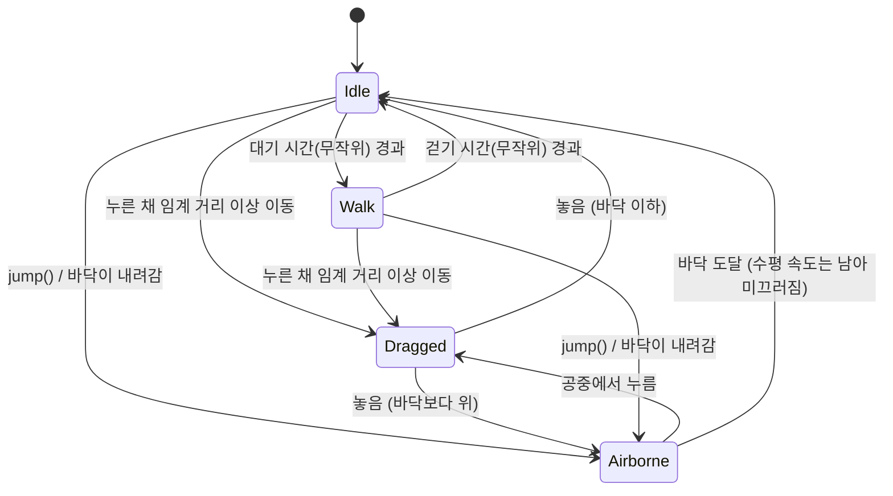

# character 모듈 상세 설계

| 항목 | 내용 |
|---|---|
| CMake 타깃 | `deskpet_character` (STATIC) |
| 네임스페이스 | `deskpet::character` |
| 의존 | `deskpet_core` |
| 관련 요구사항 | FR-10 ~ FR-13, FR-16, FR-17, FR-20, FR-21 |

## 1. 책임

캐릭터의 **상태와 움직임**을 계산하는 도메인 로직입니다.

- 하는 일: 상태 머신(대기/드래그/공중), 드래그 판정, 중력·점프 물리, 바닥 충돌, 애니메이션 파라미터(숨쉬기, 깜빡임, 착지 반동) 계산
- 하지 않는 일: 창 이동, 그리기, OS 입력 처리. 이 모듈은 "캐릭터가 화면의 어디에, 어떤 모습으로 있어야 하는가"만 답합니다.

## 2. 파일 구성

| 파일 | 역할 |
|---|---|
| `src/character/CharacterState.h/.cpp` | `State` 열거형, 문자열 변환 |
| `src/character/CharacterController.h/.cpp` | 상태 머신, 물리, 포즈 계산 |

## 3. 공개 인터페이스

```cpp
namespace deskpet::character {

enum class State : std::uint8_t { Idle, Dragged, Airborne, Walk };
[[nodiscard]] std::string_view toString(State state);

struct Params {
    float gravity = 2400.0f;              // px/s² (아래 방향 +)
    float jumpSpeed = 900.0f;             // px/s  (위로 쏘는 초기 속도)
    float dragThreshold = 4.0f;           // px    (이 거리 이상 움직여야 드래그)
    float maxFallSpeed = 4000.0f;         // px/s  (종단 속도)
    float breathPeriod = 2.4f;            // s
    float breathAmplitude = 3.0f;         // px
    float blinkInterval = 3.5f;           // s
    float blinkDuration = 0.12f;          // s
    float landingSquashDuration = 0.18f;  // s
    float landingSquashAmount = 0.18f;    // 0 ~ 1 (세로로 줄어드는 비율)
    // 던지기·경계 (FR-16, FR-17)
    float throwSampleWindow = 0.1f;       // s, 마지막 이동 직전 이 시간의 평균 속도로 던짐
    float maxThrowSpeed = 3000.0f;        // px/s
    float airDrag = 0.8f;                 // 1/s, 공중 수평 속도 지수 감쇠
    float groundFriction = 1500.0f;       // px/s², 바닥에서 미끄러질 때 감속
    float wallRestitution = 0.5f;         // 벽 반사 후 남는 속도 비율
    // 걷기
    float walkSpeed = 60.0f;              // px/s, 0이면 걷지 않음
    float idleTimeMin = 6.0f, idleTimeMax = 15.0f;  // s, 걷기 전 대기
    float walkTimeMin = 2.0f, walkTimeMax = 5.0f;   // s, 한 번 걷는 시간
    std::uint32_t randomSeed = 0;         // 테스트에서 결정적으로 만들기 위해 주입

    [[nodiscard]] static Params fromConfig(const core::CharacterConfig& config);
};

struct Pose {
    State state = State::Idle;
    float breathOffset = 0.0f;  // px, 위쪽이 음수
    bool eyesClosed = false;
    float squash = 0.0f;        // 0 = 원래 모양, 양수 = 세로로 눌림
    int facing = 0;             // 걷는 방향 -1/+1, 그 외 0
    float time = 0.0f;          // 누적 시간 (s) — 애니메이션 주기 동작의 위상
};

class CharacterController {
public:
    explicit CharacterController(Params params = {});

    void setGround(float groundY);
    [[nodiscard]] float ground() const noexcept;
    void setHorizontalBounds(float minX, float maxX);  // 발 x 범위 (FR-17), 현재 위치도 맞춤

    void teleport(core::Vec2 feet);       // 위치 강제 지정, 속도 0, 상태 재판정
    [[nodiscard]] core::Vec2 position() const noexcept;   // 발 위치 (화면 좌표)
    [[nodiscard]] core::Vec2 velocity() const noexcept;
    [[nodiscard]] State state() const noexcept;

    void onPointerDown(core::Vec2 screen);
    void onPointerMove(core::Vec2 screen);
    void onPointerUp(core::Vec2 screen);
    bool jump();                          // Idle, Walk일 때만 성공

    void update(float dt);                // 고정 시간 간격으로 호출
    [[nodiscard]] Pose pose() const;
};
}
```

## 4. 동작 명세

### 4.1 상태 전이표

| 현재 상태 | 이벤트 / 조건 | 다음 상태 | 동작 |
|---|---|---|---|
| Idle | `onPointerDown` | Idle | 누른 위치, 잡은 오프셋(`발 − 커서`) 기록 |
| Idle | `onPointerMove`, 누른 상태, 이동 거리 ≥ `dragThreshold` | **Dragged** | 발 위치 = 커서 + 잡은 오프셋 |
| Idle | `jump()` | **Airborne** | `velocity.y = −jumpSpeed` |
| Idle | `update`, 발이 바닥보다 위 (바닥이 내려감) | **Airborne** | 낙하 시작 |
| Idle | `update`, 발이 바닥보다 아래 (바닥이 올라감) | Idle | 발을 바닥으로 맞춤 |
| Dragged | `onPointerMove` | Dragged | 발 위치 = 커서 + 잡은 오프셋 |
| Dragged | `onPointerUp`, 발이 바닥보다 위 | **Airborne** | 속도 0에서 낙하 시작 |
| Dragged | `onPointerUp`, 발이 바닥 이하 | **Idle** | 발을 바닥으로 맞춤 |
| Dragged | `jump()` | Dragged | 무시 (`false` 반환) |
| Airborne | `onPointerDown` | **Dragged** | 공중에서 붙잡음, 속도 0 |
| Airborne | `update` | Airborne | 반암시적 오일러 적분 (아래 참고) |
| Airborne | `update`, 발이 바닥에 닿음 | **Idle** | 발 = 바닥, 속도 0, 착지 반동 타이머 시작 |



| 현재 상태 | 이벤트 / 조건 | 다음 상태 | 동작 |
|---|---|---|---|
| Dragged | `onPointerUp` | Airborne / Idle | **던지기 속도**(§4.5)를 적용. 바닥 높이면 수평 속도만 남김 |
| Idle | `update`, 수평 속도 ≠ 0 | Idle | 바닥 마찰로 감속하며 미끄러짐. 벽에서 반사 |
| Idle | `update`, 정지 상태로 `idleTimer` 소진, `walkSpeed > 0`, 누르지 않음 | **Walk** | 방향 무작위(±1), `walkTimer` 무작위 |
| Walk | `update` | Walk | `x += 방향 × walkSpeed × dt`. 벽에 닿으면 방향 반전 |
| Walk | `walkTimer` 소진 | **Idle** | `idleTimer` 다시 뽑음 |

### 4.2 물리 적분

`Airborne` 상태의 한 스텝(`dt`)은 **반암시적 오일러(semi-implicit Euler)** 입니다. 속도를 먼저 갱신하고 새 속도로 위치를 갱신합니다. 단순 오일러보다 안정적입니다.

```text
velocity.y = min(velocity.y + gravity * dt, maxFallSpeed)
velocity.x *= exp(-airDrag * dt)          # 공기 저항. 지수 감쇠라 dt가 커도 부호가 뒤집히지 않음
position  += velocity * dt
벽 충돌 (§4.6)
if position.y >= ground:
    position.y = ground; velocity.y = 0; state = Idle; landingTimer = landingSquashDuration
```

바닥(Idle)에서 수평 속도가 남아 있으면 `|vx| -= groundFriction × dt` (0 아래로 내려가지 않음).

- 좌표계는 화면 좌표이므로 **y가 아래로 증가**합니다. 점프 속도는 음수(위쪽)입니다.
- 이론상 점프 최고 높이는 `jumpSpeed² / (2 × gravity)` 입니다. 기본값이면 약 169px.

### 4.3 포즈 계산

| 값 | 규칙 |
|---|---|
| `breathOffset` | Idle일 때 `−breathAmplitude × sin(2π × t / breathPeriod)`, 그 외 0 |
| `eyesClosed` | Airborne이 아닐 때 `fmod(t, blinkInterval) ≥ blinkInterval − blinkDuration` |
| `squash` | 착지 반동 타이머가 남아 있으면 `landingSquashAmount × (남은 시간 / 지속 시간)`, 아니면 0 |

`t`는 `update`로 누적된 시간입니다. 실제 시계를 읽지 않으므로 테스트가 결정적입니다.

### 4.5 던지기 속도 (FR-16)

- 포인터 샘플 `(화면 좌표, t)`를 8칸 링 버퍼에 기록 (`onPointerDown`에서 초기화).
- 같은 스텝(`t` 동일)의 이동은 마지막 칸을 덮어쓰고, 위치가 같으면 기록하지 않음 → 마지막 칸은 항상 "마지막으로 움직인 시각".
- 놓을 때: `t − 마지막 이동 시각 > throwSampleWindow`면 멈췄다가 놓은 것 → 속도 0.
- 아니면 마지막 이동 기준 `throwSampleWindow` 안의 가장 오래된 샘플과의 평균 속도. 크기는 `maxThrowSpeed`로 제한.
- 포인터 이벤트에 시각이 없어 고정 스텝 시간(`t`)을 쓰므로 해상도는 1/60초입니다.

### 4.6 화면 경계 (FR-17)

발 x는 `[minX, maxX]` 안에 있습니다. 앱이 가상 데스크톱 좌우 끝에서 창 반폭만큼 안쪽으로 설정합니다.

| 상태 | 경계에 닿으면 |
|---|---|
| Airborne, Idle(미끄러짐) | 위치를 경계로, `vx = −vx × wallRestitution` (반사) |
| Walk | 위치를 경계로, 걷는 방향 반전 |
| Dragged | 제한 없음 (커서를 따라감). 놓는 순간 경계로 맞춤 |

### 4.4 경계 조건

- `onPointerMove`/`onPointerUp`은 `onPointerDown` 없이 호출되면 무시합니다 (창 밖에서 누르고 들어온 경우 등).
- `update(dt)`에서 `dt ≤ 0`이면 아무것도 하지 않습니다.
- `teleport`는 바닥보다 위면 Airborne, 아니면 바닥으로 맞추고 Idle이 됩니다. 진행 중이던 드래그는 취소됩니다.

## 5. 테스트 항목

`tests/character/CharacterControllerTests.cpp`

| 테스트 | 요구사항 |
|---|---|
| 바닥 위로 순간이동하면 Idle | FR-05 |
| 임계 거리 미만 이동은 드래그가 아님 | FR-11 |
| 임계 거리 이상 이동하면 Dragged, 잡은 오프셋 유지 | FR-10 |
| 공중에서 놓으면 낙하해 바닥에서 Idle | FR-12 |
| 바닥 아래에서 놓으면 바닥으로 맞춰지고 Idle | FR-12 |
| 점프 후 최고 높이가 이론값 근처, 결국 착지 | FR-13 |
| 드래그 중 점프는 무시 | FR-13 |
| 공중에서 붙잡기 | FR-10 |
| 바닥이 내려가면 낙하 | FR-15 |
| 종단 속도 제한 | FR-12 |
| 착지 반동이 생겼다가 0으로 줄어듦 | FR-21 |
| 깜빡임이 주기적으로 발생 | FR-20 |
| 최근 드래그 속도로 던져짐 / 멈췄다가 놓으면 속도 0 / 최대 속도 제한 | FR-16 |
| 던진 뒤 공기 저항으로 감속, 착지 후 마찰로 정지 | FR-16 |
| 벽에 던지면 반사되고 범위 밖으로 나가지 않음, 범위 밖에서 놓으면 안으로 맞춤 | FR-17 |
| 대기 시간 뒤 걷기 → 걷기 시간 뒤 Idle, 벽에서 뒤돌기, `walkSpeed = 0`이면 걷지 않음, 걷는 중 점프 | — |

## 6. 확장 지점

| TODO | 내용 |
|---|---|
| ~~`TODO(M1)`~~ | ✅ 던지기 (FR-16) |
| ~~`TODO(M1)`~~ | ✅ 화면 경계: 좌우 벽 반사 (FR-17) |
| ~~`TODO(M1)`~~ | ✅ 걷기(Walk) |
| `TODO(M6)` | 앉기(Sit), 잠자기(Sleep) — 상태가 더 늘면 상태 패턴(State 클래스)으로 리팩터링 검토 |
| `TODO(M4)` | `Pose`에 애니메이션 클립 이름·재생 시간, 표정 가중치 추가 |
| `TODO(M6)` | 시선 목표(LookAt) 좌표 추가 |
