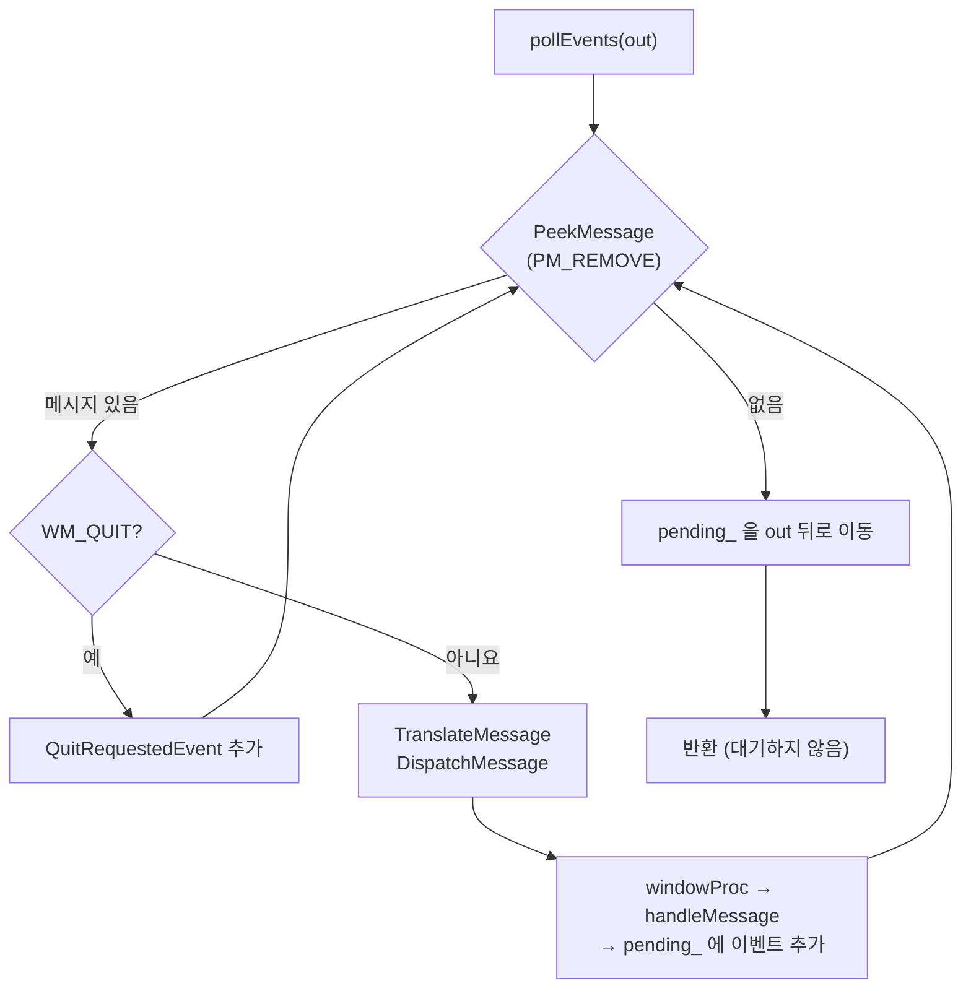

# platform 모듈 상세 설계

| 항목 | 내용 |
|---|---|
| CMake 타깃 | `deskpet_platform_api` (INTERFACE), `deskpet_platform_win32` (STATIC, Windows 전용) |
| 네임스페이스 | `deskpet::platform`, `deskpet::platform::win32` |
| 의존 | `deskpet_core` / Win32 (`user32`, `gdi32`, `shell32`) |
| 관련 요구사항 | FR-02 ~ FR-04, FR-10, FR-14, FR-15, FR-17, FR-18, DEBT-01, DEBT-02 |

## 1. 책임

운영체제의 창과 입력을 **플랫폼 독립 인터페이스** 뒤로 숨깁니다.

- 하는 일: 창 생성·표시·이동, OS 메시지를 `core::Event`로 변환, 클릭 통과 전환, 커서 위치 조회, 컨텍스트 메뉴 표시, 모니터 작업 영역 조회
- 하지 않는 일: 드래그 판정(→ character), 메뉴 항목 결정(→ app), 그리기(→ renderer)

## 2. 파일 구성

| 파일 | 역할 |
|---|---|
| `src/platform/IWindow.h` | 창 인터페이스, `WindowDesc`, `MenuItem` |
| `src/platform/win32/Win32Window.h/.cpp` | Win32 구현 |
| `src/platform/win32/Win32Strings.h/.cpp` | UTF-8 ↔ UTF-16 변환 (`widen`, `narrow`) |

## 3. 공개 인터페이스

```cpp
namespace deskpet::platform {

struct WindowDesc {
    std::string title = "DeskPet";     // UTF-8
    core::SizeI size{200, 200};
    core::PointI position{0, 0};       // 화면 좌표, 창 좌상단
    bool alwaysOnTop = true;
};

struct MenuItem {
    int id = 0;                        // 0은 "선택 안 함"으로 예약
    std::string label;                 // UTF-8
    bool enabled = true;
    bool separator = false;
    [[nodiscard]] static MenuItem makeSeparator();
};

class IWindow {
public:
    virtual ~IWindow() = default;
    [[nodiscard]] virtual bool create(const WindowDesc& desc) = 0;
    virtual void show() = 0;
    virtual void hide() = 0;
    virtual void pollEvents(std::vector<core::Event>& out) = 0;      // out 뒤에 추가
    virtual void waitForEvents(int timeoutMs) = 0;                   // 입력이 오거나 시간이 지날 때까지 잠듦
    virtual void setPosition(core::PointI topLeft) = 0;
    [[nodiscard]] virtual core::PointI position() const = 0;
    virtual void setSize(core::SizeI size) = 0;
    [[nodiscard]] virtual core::SizeI size() const = 0;
    [[nodiscard]] virtual core::RectI workArea() const = 0;          // 창이 있는 모니터의 작업 영역
    [[nodiscard]] virtual core::RectI desktopBounds() const = 0;     // 가상 데스크톱 (모든 모니터)
    [[nodiscard]] virtual float dpiScale() const = 0;                // 1.0 = 96 DPI
    virtual bool showTrayIcon(const std::string& tooltip) = 0;      // 클릭 → TrayMenuRequestedEvent
    virtual void setClickThrough(bool enabled) = 0;        // true면 클릭이 아래 창으로 (FR-04)
    virtual core::PointI cursorPosition() const = 0;       // 화면 좌표 (클릭 통과 중엔 마우스 메시지가 없음)
    [[nodiscard]] virtual int showContextMenu(const std::vector<MenuItem>& items,
                                              core::PointI screen) = 0; // 선택한 id, 취소 시 0
    [[nodiscard]] virtual void* nativeHandle() const = 0;            // Win32에서는 HWND
};
}
```

- 인터페이스에 `HWND` 같은 OS 타입을 노출하지 않습니다. 렌더러처럼 OS 핸들이 꼭 필요한 곳에는 `void*`로 전달합니다.
- 복사·이동을 막습니다 (창 핸들은 하나의 소유자만 가져야 함).

## 4. 동작 명세 (Win32 구현)

### 4.1 창 스타일

| 스타일 | 목적 | 요구사항 |
|---|---|---|
| `WS_POPUP` | 제목 표시줄·테두리 없음 | FR-01 |
| `WS_EX_NOREDIRECTIONBITMAP` | GDI 리다이렉션 비트맵 없음 → DirectComposition 전용 | FR-01, NFR-PERF-03 |
| `WS_EX_TOPMOST` (`alwaysOnTop`일 때) | 항상 위 | FR-02 |
| `WS_EX_TOOLWINDOW` | 작업 표시줄·Alt+Tab에서 숨김 | FR-03 |
| 클래스 스타일 `CS_DBLCLKS` | 더블클릭 메시지 수신 | FR-13 |

### 4.2 메시지 → 이벤트 변환

| Win32 메시지 | 처리 | 생성 이벤트 |
|---|---|---|
| `WM_LBUTTONDOWN` | `SetCapture` | `PointerDownEvent{Left}` |
| `WM_MOUSEMOVE` | — | `PointerMoveEvent` |
| `WM_LBUTTONUP` | 캡처 중이면 `ReleaseCapture` | `PointerUpEvent{Left}` |
| `WM_CAPTURECHANGED` | 우리가 놓은 게 아닌데 캡처를 잃음 (Alt+Tab 등) | `PointerUpEvent{Left}` (드래그가 영원히 끝나지 않는 것을 방지) |
| `WM_LBUTTONDBLCLK` | — | `DoubleClickEvent{Left}` |
| `WM_RBUTTONUP` | — | `PointerUpEvent{Right}` |
| `WM_MOUSEACTIVATE` | `MA_NOACTIVATE` 반환 | 없음 — 펫을 클릭해도 사용자가 쓰던 창의 포커스를 빼앗지 않음 |
| `WM_DISPLAYCHANGE`, `WM_SETTINGCHANGE(SPI_SETWORKAREA)` | — | `WorkAreaChangedEvent` |
| `WM_CLOSE`, `WM_QUIT` | 창을 직접 파괴하지 않음 | `QuitRequestedEvent` |
| `WM_DPICHANGED` | 제안 사각형(lParam)은 쓰지 않음 — 앱이 발 위치 기준으로 크기·위치를 정함 | `DpiChangedEvent{HIWORD(wParam) / 96}` |
| `WM_APP+1` (트레이 콜백) | `NOTIFYICON_VERSION_4`: `LOWORD(lParam)`이 `WM_CONTEXTMENU`, `NIN_SELECT`, `NIN_KEYSELECT`일 때, 좌표는 `wParam` | `TrayMenuRequestedEvent` |
| `TaskbarCreated` (등록 메시지) | 탐색기 재시작 시 트레이 아이콘 재등록 | 없음 |
| `WM_PAINT` | `ValidateRect`만 호출 (그리기는 렌더러 담당) | 없음 |
| `WM_ERASEBKGND` | 1 반환 (배경 지우기 생략) | 없음 |

- 포인터 좌표는 `lParam`(클라이언트 좌표)이 아니라 **`GetMessagePos()`(메시지 발생 시점의 화면 좌표)** 를 사용합니다 ([ADR-0003](../02-architecture/adr/0003-manual-window-drag.md)).
- 더블클릭 시 메시지 순서는 `DOWN → UP → DBLCLK → UP` 입니다. 두 번째 DOWN이 DBLCLK로 바뀌므로 캡처가 시작되지 않으며, character 모듈은 누르지 않은 상태의 UP을 무시합니다.

### 4.3 `pollEvents` 흐름



- `pollEvents`는 **절대 대기하지 않습니다** (`GetMessage` 대신 `PeekMessage`). 프레임 속도 조절은 렌더러의 `Present(VSync)`가 담당합니다.
- 렌더러가 Present를 생략했거나(DEBT-02) 창이 숨겨졌을 때는 VSync 대기가 없으므로, 앱이 `waitForEvents`를 호출합니다. 구현은 `MsgWaitForMultipleObjectsEx(QS_ALLINPUT, MWMO_INPUTAVAILABLE)`로, 입력이 오면 즉시 깨어납니다.

### 4.4 기타 함수

| 함수 | 구현 |
|---|---|
| `setPosition` | 이전 위치와 같으면 아무것도 하지 않음. 다르면 `SetWindowPos(SWP_NOSIZE \| SWP_NOZORDER \| SWP_NOACTIVATE)` |
| `workArea` | 창이 있으면 `MonitorFromWindow`, 없으면 주 모니터 → `GetMonitorInfoW().rcWork` |
| `desktopBounds` | `GetSystemMetrics(SM_X/YVIRTUALSCREEN, SM_CX/CYVIRTUALSCREEN)`. 주 모니터 왼쪽·위에 모니터가 있으면 음수 좌표 |
| `dpiScale` | `GetDpiForWindow / 96`. 매니페스트가 PerMonitorV2라 창이 있는 모니터 기준 |
| `setSize` | `SetWindowPos(SWP_NOMOVE \| SWP_NOZORDER \| SWP_NOACTIVATE)` |
| `hide` / `show` | `ShowWindow(SW_HIDE / SW_SHOWNOACTIVATE)` |
| `showTrayIcon` | `Shell_NotifyIconW(NIM_ADD)` + `NIM_SETVERSION(4)`. 아이콘은 시스템 기본(`IDI_APPLICATION`). 소멸자에서 `NIM_DELETE` (없으면 "유령 아이콘"이 남음) |
| 창 스타일 | `WS_EX_NOREDIRECTIONBITMAP | WS_EX_TOOLWINDOW | WS_EX_LAYERED | WS_EX_TRANSPARENT` (+ 항상 위). LAYERED + TRANSPARENT = 클릭이 아래 창으로 통과. DirectComposition 창에 LAYERED를 함께 걸어도 그리기는 그대로임을 실험으로 확인 (`WindowFromPoint`·화면 캡처). LAYERED 창은 `SetLayeredWindowAttributes(255)`를 한 번 불러야 보임 |
| `setClickThrough` | `GWL_EXSTYLE`의 `WS_EX_TRANSPARENT`만 켜고 끔. 같은 상태면 건드리지 않음. 예전의 `SetWindowRgn`(도형 영역)은 클릭뿐 아니라 **그리기도 잘라내서**(학습 노트 #17) 없앰 |
| `cursorPosition` | `GetCursorPos` |
| `showContextMenu` | `CreatePopupMenu` → 항목 추가(UTF-8→UTF-16) → `SetForegroundWindow` → `TrackPopupMenu(TPM_RETURNCMD)` → `PostMessage(WM_NULL)` (메뉴가 바로 닫히지 않는 알려진 문제 회피) |

### 4.5 창 프로시저와 `this` 연결

정적 함수인 창 프로시저에서 객체에 접근하기 위해, `CreateWindowExW`의 마지막 인자로 `this`를 넘기고 `WM_NCCREATE`에서 `SetWindowLongPtrW(GWLP_USERDATA)`에 저장합니다. 이후 메시지는 저장된 포인터의 `handleMessage`로 전달합니다.

## 5. 테스트 항목

Win32 구현은 단위 테스트 대신 **수동 테스트 체크리스트**로 검증합니다. 로직은 character/app에 있으므로 이 계층은 얇게 유지합니다.

| # | 확인 사항 |
|---|---|
| 1 | 실행 시 작업 표시줄과 Alt+Tab에 나타나지 않는다 |
| 2 | 다른 창을 최대화해도 펫이 위에 있다 |
| 3 | 펫을 클릭해도 사용 중이던 창의 포커스가 유지된다 |
| 4 | 펫 바깥(창의 투명한 모서리)을 클릭하면 아래 창이 클릭된다 |
| 5 | 드래그 중 Alt+Tab을 눌러도 드래그가 정상 종료된다 |
| 6 | 작업 표시줄 위치를 바꾸면 펫이 새 바닥으로 이동한다 |
| 7 | 트레이 아이콘을 클릭하면 같은 메뉴가 뜨고, 숨기기/보이기/종료가 동작한다 (FR-18). 종료 후 아이콘이 남지 않는다 |
| 8 | 배율이 다른 모니터로 옮기면 크기가 배율에 맞게 바뀐다 (DEBT-01) |
| 9 | 두 번째 실행은 즉시 종료되고 펫은 하나만 보인다 (FR-19) |

## 6. 확장 지점

| TODO | 내용 |
|---|---|
| ~~`TODO(M1)`~~ | ✅ 트레이 아이콘. 콜백 메시지를 창 프로시저가 받아야 해서 별도 `ITrayIcon` 대신 `IWindow::showTrayIcon`으로 구현 |
| ~~`TODO(M1)`~~ | ✅ 단일 인스턴스 — 이름 있는 뮤텍스는 진입점(`main_win32.cpp`)에서 처리 |
| ~~`TODO(M1)`~~ | ✅ `WM_DPICHANGED` → `DpiChangedEvent` |
| `TODO(M6)` | 전용 트레이 아이콘 리소스 (.ico) |
| ~~`TODO(M5)`~~ | ✅ 알파 기반 클릭 통과 (`setClickThrough` + 렌더러 `sampleAlpha`) |
| `TODO(M6)` | 다른 창 목록 조회 (`EnumWindows`, `DwmGetWindowAttribute(DWMWA_EXTENDED_FRAME_BOUNDS)`) |
