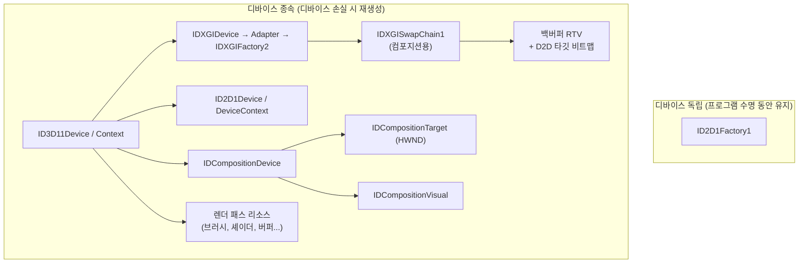
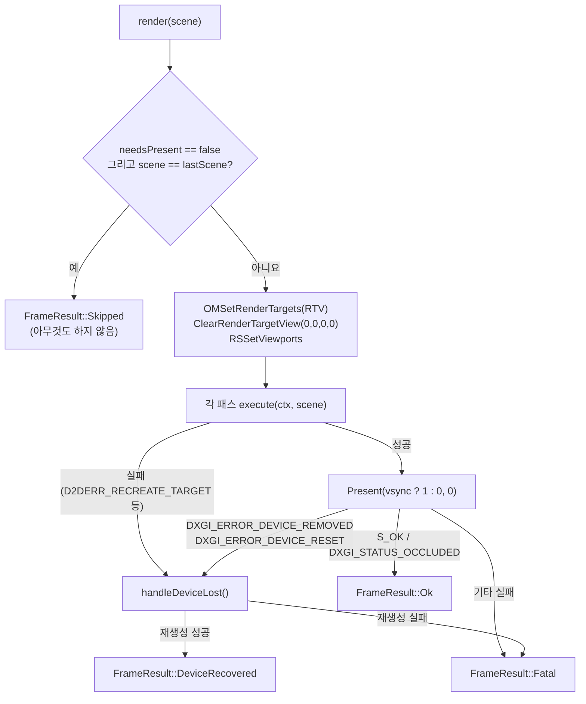

# renderer 모듈 상세 설계

| 항목 | 내용 |
|---|---|
| CMake 타깃 | `deskpet_renderer_api` (INTERFACE), `deskpet_renderer_d3d11` (STATIC, Windows 전용) |
| 네임스페이스 | `deskpet::renderer`, `deskpet::renderer::d3d11` |
| 의존 | `deskpet_core` / `d3d11`, `dxgi`, `d2d1`, `dcomp` |
| 관련 요구사항 | FR-01, FR-20, FR-33, NFR-PERF-01, NFR-PERF-03, NFR-REL-01 |

## 1. 책임

`RenderScene` 데이터를 받아 투명한 창에 그립니다.

- 하는 일: GPU 디바이스·스왑체인·DirectComposition 설정, 렌더 패스 실행, Present, 크기 변경, 디바이스 손실 복구
- 하지 않는 일: 캐릭터 상태 판단, 애니메이션 시간 계산 (모든 값은 `RenderScene`으로 받음)

## 2. 파일 구성

| 파일 | 역할 |
|---|---|
| `src/renderer/RenderScene.h` | 렌더러 입력 데이터 (플랫폼 독립) |
| `src/renderer/IRenderer.h` | 렌더러 인터페이스, `RendererOptions`, `FrameResult` |
| `src/renderer/d3d11/D3D11Renderer.h/.cpp` | D3D11 + DComp 구현 |
| `src/renderer/d3d11/D3D11Context.h` | 패스에 넘기는 디바이스 묶음 |
| `src/renderer/d3d11/IRenderPass.h` | 렌더 패스 인터페이스 |
| `src/renderer/d3d11/PlaceholderPass.h/.cpp` | Direct2D로 그리는 임시 캐릭터 |
| `src/renderer/d3d11/MeshPass.h/.cpp` | VRM 정적 메시를 D3D11로 그리는 패스 (ADR-0008) |
| `src/renderer/d3d11/WicTexture.h/.cpp` | `model::Texture` → 텍스처. `encoded`는 WIC 디코딩, `rgba`(TGA)는 WIC 비트맵으로 감싸 같은 축소 경로 사용 + 밉맵 |
| `src/renderer/d3d11/shaders/Mesh.hlsl` | 메시 VS/PS. 빌드 시 `fxc /Fh`로 `g_MeshVS.h`·`g_MeshPS.h` 생성 |
| `src/renderer/d3d11/DxCheck.h/.cpp` | HRESULT 검사·로그 도우미 |

## 3. 공개 인터페이스

```cpp
namespace deskpet::renderer {

struct PlaceholderCharacter {
    bool visible = true;
    core::Vec2 center;          // 창 내부 좌표 (px)
    float radiusX = 0.0f;
    float radiusY = 0.0f;
    bool eyesClosed = false;
};

// VRM 캐릭터 (ADR-0008). model이 nullptr이면 그리지 않음
struct MeshCharacter {
    const model::Model* model = nullptr;  // 소유하지 않음. 주소가 바뀌면 GPU에 다시 업로드
    core::Mat4 viewProjection;            // 모델 공간 → 클립 공간 (행 벡터 규약)
    core::Vec3 lightDirection;            // 빛이 진행하는 방향 (모델 공간)
};

struct RenderScene {
    core::SizeI viewport;
    PlaceholderCharacter placeholder;
    MeshCharacter character;
};

struct RendererOptions {
    bool vsync = true;
    bool debugLayer = false;
};

enum class FrameResult : std::uint8_t {
    Ok,               // 정상
    DeviceRecovered,  // 디바이스 손실이 있었지만 복구됨 (이번 프레임은 버려짐)
    Skipped,          // 직전 프레임과 같아 Present 생략 → 호출자가 직접 쉬어야 함 (DEBT-02)
    Fatal,            // 복구 불가 → 앱 종료
};

class IRenderer {
public:
    virtual ~IRenderer() = default;
    [[nodiscard]] virtual bool initialize(void* nativeWindow, core::SizeI size,
                                          const RendererOptions& options) = 0;
    [[nodiscard]] virtual FrameResult render(const RenderScene& scene) = 0;
    virtual void resize(core::SizeI size) = 0;
    virtual void shutdown() = 0;
};
}
```

## 4. 동작 명세 (D3D11 구현)

### 4.1 리소스 구성과 수명



생성 순서 (`createDeviceResources`)

1. **디바이스**: `D3D11CreateDevice(HARDWARE, BGRA_SUPPORT [| DEBUG])`
   - 디버그 플래그로 실패하면(그래픽 도구 미설치) 경고 후 플래그 없이 재시도
   - 하드웨어 생성이 실패하면 `D3D_DRIVER_TYPE_WARP`(소프트웨어)로 재시도
2. **스왑체인**: 디바이스의 어댑터에서 얻은 `IDXGIFactory2`로 `CreateSwapChainForComposition`
   - `B8G8R8A8_UNORM`, `FLIP_SEQUENTIAL`, 버퍼 2개, `ALPHA_MODE_PREMULTIPLIED`
   - 같은 어댑터의 팩토리를 쓰는 이유: 다중 GPU 노트북에서 디바이스와 팩토리의 어댑터가 어긋나는 문제 방지
3. **Direct2D**: 같은 DXGI 디바이스로 `ID2D1Device` → `ID2D1DeviceContext`
4. **DirectComposition**: `DCompositionCreateDevice` → `CreateTargetForHwnd(topmost=TRUE)` → `CreateVisual` → `SetContent(swapChain)` → `SetRoot` → `Commit`
5. **렌더 타깃**: 백버퍼 0번으로 RTV와 D2D 타깃 비트맵 생성
6. **렌더 패스**: 각 패스의 `create(context)`

해제는 **역순**입니다 (`releaseDeviceResources`).

### 4.2 프레임 처리 (`render`)



- 투명 배경은 `(0, 0, 0, 0)`으로 지웁니다. premultiplied alpha이므로 RGB도 0이어야 완전 투명입니다.
- `Present(1, 0)`은 다음 VSync까지 스레드를 재우므로 별도의 `Sleep` 없이 CPU 사용률이 낮게 유지됩니다.
- **Present 생략 (DEBT-02)**: `RenderScene`은 `operator==`를 가지며, 직전에 Present한 장면과 같으면 아무것도 하지 않고 `Skipped`를 반환합니다. DirectComposition은 마지막으로 Present된 버퍼를 계속 합성하므로 화면은 그대로이고, 창 이동(드래그)은 장면이 아니라 창 위치만 바뀌므로 역시 생략됩니다. 디바이스 재생성·`resize` 뒤에는 `needsPresent_`로 반드시 한 번 그립니다. VSync 대기가 없어지므로 앱이 `waitForEvents(16ms)`로 쉽니다.
- 슬라임과 대기 동작(숨쉬기)을 켠 모델은 매 프레임 장면이 바뀌어 생략되지 않습니다. `[animation] idle_motion = false`면 대기 중 장면이 같아져 생략됩니다. 측정(Seed-san, Release): GPU 3D 1.6% → 0%, CPU 0.17% → 0.04%.

### 4.3 렌더 패스

```cpp
namespace deskpet::renderer::d3d11 {
struct D3D11Context {
    ID3D11Device* device;
    ID3D11DeviceContext* context;
    ID3D11RenderTargetView* renderTarget;
    ID2D1DeviceContext* d2d;
    core::SizeI viewport;
};

class IRenderPass {
public:
    virtual ~IRenderPass() = default;
    [[nodiscard]] virtual std::string_view name() const = 0;
    [[nodiscard]] virtual bool create(const D3D11Context& ctx) = 0;   // 디바이스 종속 리소스 생성
    [[nodiscard]] virtual bool execute(const D3D11Context& ctx, const RenderScene& scene) = 0;
    virtual void release() = 0;                                        // 디바이스 종속 리소스 해제
};
}
```

| 패스 | 마일스톤 | API | 내용 |
|---|---|---|---|
| `PlaceholderPass` | M0 | Direct2D | 타원 몸통, 눈(뜸/감음), 볼 |
| `MeshPass` | M1a~M4 | D3D11 | 정점/인덱스 버퍼, 상수 버퍼, HLSL, 깊이 버퍼, (M4) 스키닝 |
| `DebugOverlayPass` | 선택 | Direct2D + DirectWrite | FPS, 상태, 프레임 시간 표시 |

실행 순서: `MeshPass` → `PlaceholderPass`. 모델이 있으면 앱이 `placeholder.visible = false`로 둡니다.

#### MeshPass (ADR-0008)

| 항목 | 내용 |
|---|---|
| 셰이더 | `Mesh.hlsl`. 행렬은 `row_major`로 선언해 C++ 행 벡터 규약을 그대로 사용 (`mul(v, M)`). VS: 표정 오프셋을 더한 뒤 선형 블렌드 스키닝(`Σ wᵢ·Sᵢ`를 한 번 곱함), 법선은 같은 행렬의 3×3 |
| 스킨 행렬 | `StructuredBuffer<SkinMatrix>`(VS t0, 구조체로 감싸 `row_major` 적용). 상수 버퍼는 4096 float4(행렬 1024개) 제한이 있어 구조화 버퍼 사용. `DYNAMIC`, 매 그리기 프레임 `Map(WRITE_DISCARD)`. 본이 없어도 1개 만들고 `boneCount = 0`이면 스키닝 생략 |
| 표정 | 두 번째 정점 스트림(`POSITION1`, float3 × 정점 수, `DYNAMIC`). 표정 가중치가 바뀐 프레임에만 CPU에서 `Σ 가중치 × 델타`를 다시 계산해 올림 (깜빡임은 가끔이라 비용이 작음). 큰 정점 버퍼는 `IMMUTABLE`로 유지 |
| 상수 버퍼 | b0 `FrameConstants`(뷰×투영, 빛 방향), b1 `MaterialConstants`(기본색, 알파 컷오프, 텍스처 유무, 불투명 강제). `DYNAMIC` + `Map(WRITE_DISCARD)` |
| 정점 | `model::Vertex` 56바이트 (위치 12, 법선 12, UV 8, 본 인덱스 `R16G16B16A16_UINT` 8, 가중치 16). `static_assert`로 레이아웃 고정 |
| 업로드 | `scene.character.model` 주소가 바뀔 때 1회. 정점·인덱스는 `IMMUTABLE`. 텍스처는 WIC → 긴 변 512 이하로 축소(Fant) → **RGBA8로 다시 변환**(스케일러가 BGRA로 바꿔 내보낼 수 있어 R/B가 뒤바뀌는 것 방지) → `GenerateMips` |
| 컬링 | `FrontCounterClockwise = TRUE`(glTF는 CCW가 앞면). `doubleSided`면 컬링 없음 |
| 그리기 순서 | OPAQUE·MASK 먼저(깊이 쓰기), BLEND 나중(깊이 읽기만) |
| 블렌드 | premultiplied: `ONE, INV_SRC_ALPHA` (색·알파 모두). PS가 `rgb *= a` 출력 |
| 셰이딩 | 2단 툰(밝음 1.0 / 그림자 0.75). 감마 공간 그대로 계산 (선형 색공간은 M5) |
| 깊이 버퍼 | `D32_FLOAT`, 창 크기가 바뀌면 다시 만듦. 실행 후 렌더 타깃에서 분리(다음 D2D 패스용) |
| 실패 처리 | 업로드 실패는 로그 후 그리지 않음(매 프레임 재시도 안 함). 텍스처 디코딩 실패는 흰색 |

### 4.4 디바이스 손실 복구

1. `device->GetDeviceRemovedReason()`을 HRESULT 문자열로 로그에 남깁니다.
2. `releaseDeviceResources()` — 패스 → 렌더 타깃 → DComp → D2D → 스왑체인 → D3D 순서 (생성의 역순)
3. `createDeviceResources()` — 4.1의 순서
4. 성공 시 `DeviceRecovered`, 실패 시 `Fatal`

수동 테스트: Windows SDK의 `dxcap.exe -forcetdr` 로 TDR을 강제로 발생시켜 펫이 다시 그려지는지 확인합니다.

### 4.5 크기 변경 (`resize`)

RTV와 D2D 타깃 비트맵(백버퍼 참조)을 모두 해제한 뒤 `ResizeBuffers`를 호출하고 다시 만듭니다. 백버퍼 참조가 하나라도 남아 있으면 `ResizeBuffers`가 실패합니다.

### 4.6 HRESULT 검사

```cpp
namespace deskpet::renderer::d3d11 {
// 실패 시 "설명 실패: 0x887A0005 (DXGI_ERROR_DEVICE_REMOVED) [파일:줄]" 형태로 error 로그를 남기고 false 반환
[[nodiscard]] bool check(HRESULT hr, std::string_view what,
                         std::source_location where = std::source_location::current());
[[nodiscard]] std::string hresultToString(HRESULT hr);
}
```

## 5. 테스트 항목

| 방법 | 내용 |
|---|---|
| 수동 | 투명 배경에 캐릭터만 보임, 숨쉬기·깜빡임 |
| 수동 | `debug_layer = true`로 실행 시 Visual Studio 출력 창에 D3D11 경고/오류가 없음 |
| 수동 | `dxcap -forcetdr` 후 1초 안에 복구 (NFR-REL-01) |
| 측정 | 작업 관리자 CPU < 1%, 메모리 < 50MB (NFR-PERF-01, 02) |
| 선택 (M2) | WARP 디바이스로 오프스크린 렌더링 → 기준 이미지와 비교하는 스냅샷 테스트 |

## 6. 확장 지점

| TODO | 내용 |
|---|---|
| ~~`TODO(M1)`~~ | ✅ 화면 변화가 없을 때 Present 생략 (DEBT-02, §4.2) |
| ~~`TODO(M2)`~~ | ✅ M1a: HLSL 빌드 시 컴파일 (`fxc /Fh` → 헤더 내장) |
| ~~`TODO(M2)`~~ | ✅ M1a: `MeshPass` (정점/인덱스 버퍼, 상수 버퍼, 깊이, premultiplied alpha) |
| ~~`TODO(M3)`~~ | ✅ M1a: WIC 텍스처 로딩 + 밉맵. sRGB(선형 색공간) 처리는 M5로 이동 |
| `TODO(M2)` | (선택) WARP 오프스크린 스냅샷 테스트 |
| ~~`TODO(M4)`~~ | ✅ 구조화 버퍼 GPU 스키닝, 표정 모프 스트림 (ADR-0010) |
| `TODO(M5)` | MToon 셰이더, 아웃라인 패스 |
