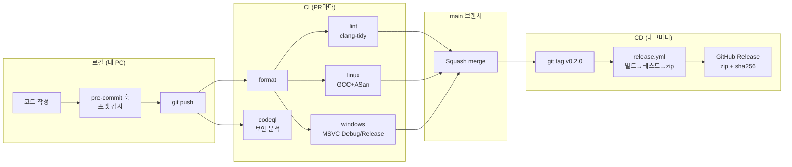

# DevOps 가이드

이 폴더는 DeskPet의 **빌드·검증·배포 자동화**를 설명합니다.

## DevOps를 한 문장으로

> 코드를 바꾸는 순간부터 사용자가 받기까지의 과정을 **자동화하고, 매번 똑같이 재현되게** 만드는 것.

| 용어 | 의미 | DeskPet에서 |
|---|---|---|
| **CI** (Continuous Integration, 지속적 통합) | 변경을 자주 합치고, 합칠 때마다 자동으로 빌드·테스트해 깨진 코드가 `main`에 들어가지 못하게 함 | PR마다 `ci.yml`이 포맷·정적 분석·Linux/Windows 빌드·테스트 실행 |
| **CD** (Continuous Delivery, 지속적 배포) | 검증된 코드를 언제든 배포 가능한 산출물로 자동 생성·배포 | 태그를 푸시하면 `release.yml`이 zip을 만들어 GitHub Release에 업로드 |
| **IaC / Pipeline as Code** | 파이프라인 설정을 코드로 저장소에 둠 | `.github/workflows/*.yml`, `CMakePresets.json` |
| **Shift-left** | 문제를 최대한 일찍(왼쪽에서) 잡음 | pre-commit 훅 → PR CI → 머지 순으로 점점 비싼 검사 |

## 전체 흐름

## 문서 목록

| 문서 | 내용 | 언제 읽나 |
|---|---|---|
| [local-development.md](local-development.md) | 로컬 개발 환경 구성, 빌드·테스트·디버깅 | 처음 시작할 때 |
| [ci-cd-implementation.md](ci-cd-implementation.md) | 파이프라인이 **어떻게 구현되어 있는지** (파일별 설명) | 구조를 이해하거나 고칠 때 |
| [ci-cd-usage.md](ci-cd-usage.md) | 파이프라인을 **어떻게 사용하는지** (GitHub 설정, PR, 릴리스, 문제 해결) | GitHub에 올릴 때, 릴리스할 때 |
| [branching-and-release.md](branching-and-release.md) | 브랜치 전략, 커밋 규칙, 버전 규칙, 릴리스 절차 | 작업 흐름을 정할 때 |

## 처음 해 볼 순서

1. [로컬 개발 환경](local-development.md)대로 빌드해서 실행해 보기
2. [사용 가이드 §1~3](ci-cd-usage.md)대로 GitHub 저장소를 만들고 푸시 → Actions 탭에서 CI가 도는 것 확인
3. 일부러 포맷을 깨뜨린 PR을 만들어 CI가 막는 것 확인 (§4의 실습)
4. [사용 가이드 §5](ci-cd-usage.md#5-릴리스-만들기)대로 `v0.1.0` 태그를 푸시해 첫 릴리스 만들기
