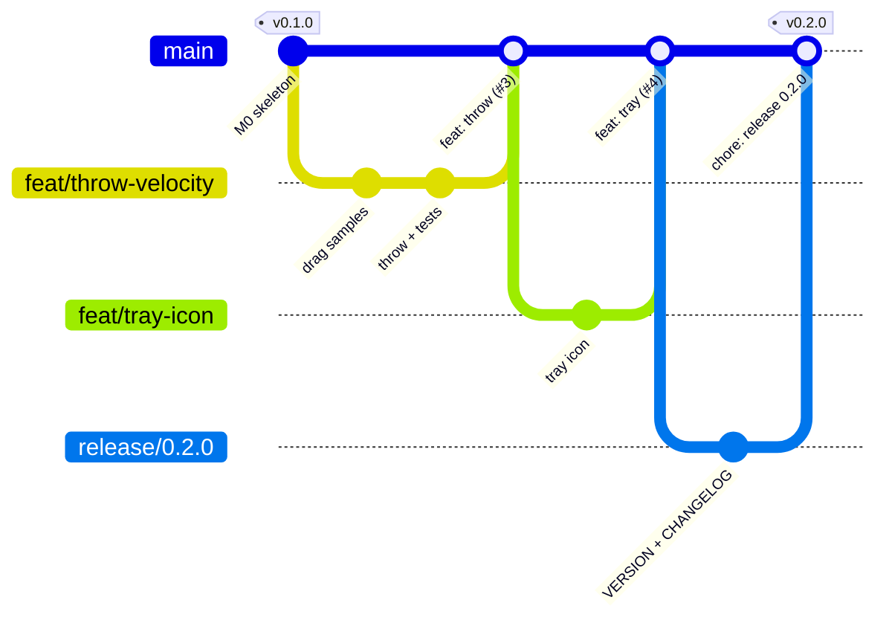

# 브랜치 · 커밋 · 버전 · 릴리스 전략

| 항목 | 내용 |
|---|---|
| 문서 ID | DP-OPS-003 |
| 요약 | **GitHub Flow** + **Conventional Commits** + **Semantic Versioning** + **태그 기반 릴리스** |

## 1. 브랜치 전략: GitHub Flow

`main` 하나만 오래 살아 있고, 모든 작업은 짧은 브랜치에서 하고 PR로 합칩니다.



### 왜 Git Flow가 아니라 GitHub Flow인가

| 전략 | 브랜치 | 적합한 경우 |
|---|---|---|
| Git Flow | `main`, `develop`, `feature/*`, `release/*`, `hotfix/*` | 여러 버전을 동시에 유지보수하는 제품, 정기 배포 |
| **GitHub Flow** | `main` + 짧은 작업 브랜치 | 항상 최신 버전 하나만 배포, 소규모 팀·개인 |
| Trunk-based | `main`에 직접(또는 아주 짧은 브랜치) + 기능 플래그 | 대규모 팀, 하루 여러 번 배포 |

DeskPet은 최신 버전 하나만 배포하는 개인 프로젝트이므로 GitHub Flow가 가장 단순하면서도 PR·CI 흐름을 모두 연습할 수 있습니다.

### 규칙

1. `main`은 **항상 빌드·테스트가 통과하는 상태**입니다 (브랜치 보호 규칙으로 강제).
2. 작업 브랜치는 짧게(가능하면 며칠 안에) 유지하고, 하나의 PR은 하나의 목적만 가집니다.
3. 머지는 **Squash and merge** — PR 하나가 `main`의 커밋 하나가 되어 이력이 깔끔하고 되돌리기 쉽습니다.
4. 머지된 브랜치는 자동 삭제합니다.

## 2. 커밋 메시지: Conventional Commits

```text
<type>(<scope>): <요약>

- <바꾼 것 1>
- <바꾼 것 2>
```

| type | 의미 | 버전 영향 (SemVer) |
|---|---|---|
| `feat` | 새 기능 | MINOR ↑ |
| `fix` | 버그 수정 | PATCH ↑ |
| `perf` | 성능 개선 | PATCH ↑ |
| `refactor` | 동작 변화 없는 구조 변경 | — |
| `test` | 테스트 추가·수정 | — |
| `docs` | 문서 | — |
| `build` | 빌드 시스템, 의존성 | — |
| `ci` | CI 설정 | — |
| `chore` | 기타 (릴리스 준비 등) | — |

- 호환성을 깨는 변경은 `feat!:` 또는 본문에 `BREAKING CHANGE:` — MAJOR ↑ (1.0.0 이후)
- Squash merge를 쓰므로 **PR 제목**이 최종 커밋 메시지가 됩니다. PR 제목을 이 형식으로 씁니다.

## 3. 버전: Semantic Versioning

`MAJOR.MINOR.PATCH` — 저장소 루트의 `VERSION` 파일이 유일한 원천입니다.

| 자리 | 올리는 경우 | 예 |
|---|---|---|
| MAJOR | 설정 파일 형식이 호환되지 않게 바뀌는 등, 사용자가 무언가를 바꿔야 할 때 | 1.0.0 → 2.0.0 |
| MINOR | 기능 추가 (하위 호환) | 0.1.0 → 0.2.0 |
| PATCH | 버그 수정 | 0.2.0 → 0.2.1 |

- `0.x.y` 동안은 개발 단계로, MINOR 업데이트에도 호환성이 깨질 수 있습니다.
- 마일스톤 하나 = MINOR 하나 ([로드맵](../06-roadmap/ROADMAP.md): M1 → 0.2.0, M2 → 0.3.0 ...). M6 완료 시 1.0.0.

## 4. 릴리스 절차 (체크리스트)

```text
[ ] 1. 마일스톤의 완료 기준을 모두 만족했다 (ROADMAP.md)
[ ] 2. 측정 기록(CPU, 메모리)을 ROADMAP.md에 남겼다
[ ] 3. release/X.Y.Z 브랜치에서 VERSION 수정
[ ] 4. CHANGELOG.md: [Unreleased] → [X.Y.Z] - YYYY-MM-DD, 하단 비교 링크 추가
[ ] 5. PR → CI 통과 → Squash merge
[ ] 6. git switch main && git pull
[ ] 7. git tag -a vX.Y.Z -m "DeskPet X.Y.Z" && git push origin vX.Y.Z
[ ] 8. Actions → Release 성공 확인
[ ] 9. Releases 페이지에서 zip을 받아 깨끗한 폴더에서 실행 확인 (재배포 패키지 없이 실행되는지)
```

명령 세부 내용은 [사용 가이드 §5](ci-cd-usage.md#5-릴리스-만들기)를 보세요.

## 5. 핫픽스

릴리스된 버전에 급한 버그가 있을 때도 같은 흐름입니다: `fix/...` 브랜치 → PR → 머지 → PATCH 버전 올려 릴리스 (예: `v0.2.1`). `main` 하나만 배포하므로 별도의 hotfix 브랜치가 필요 없습니다.
