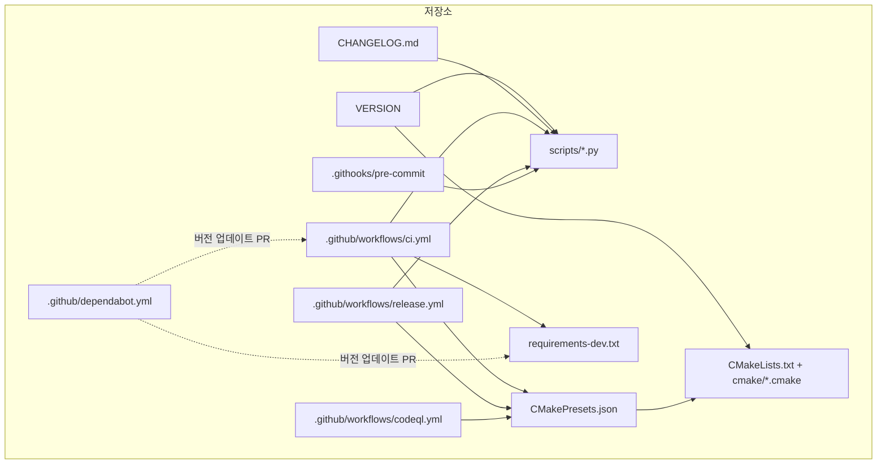
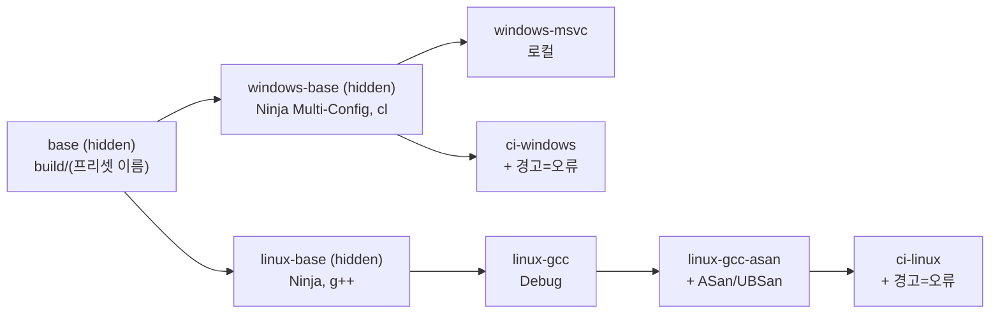
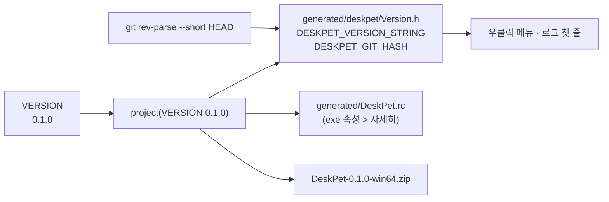
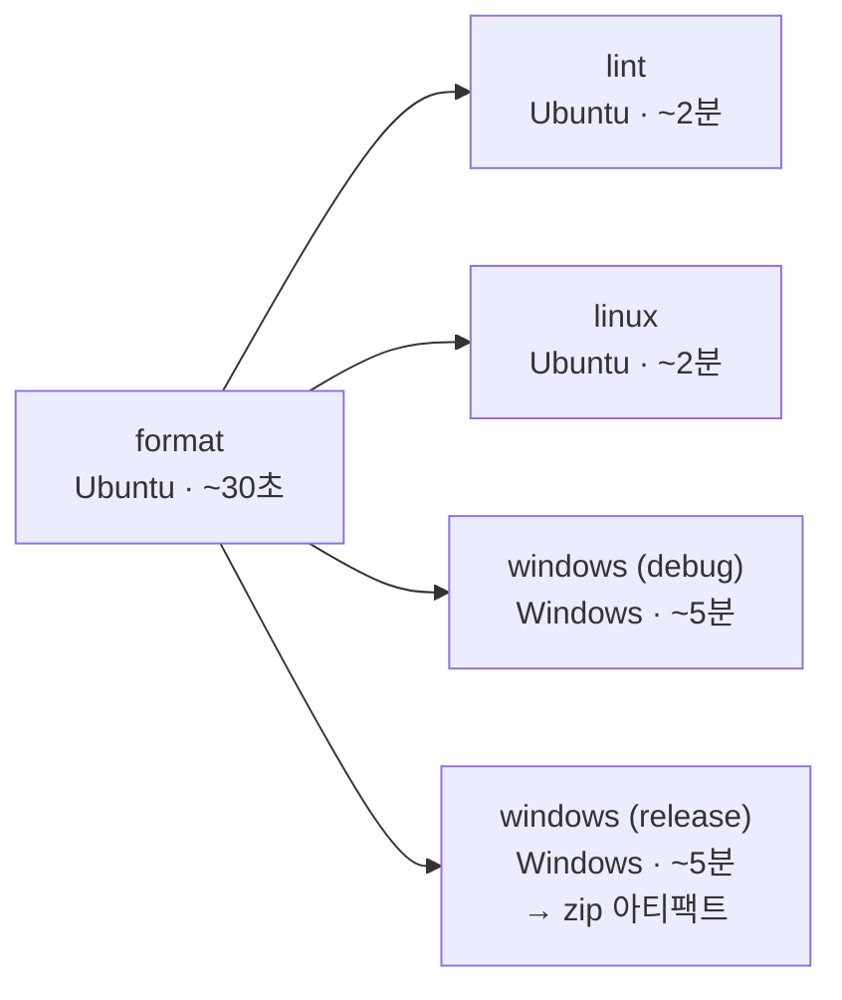
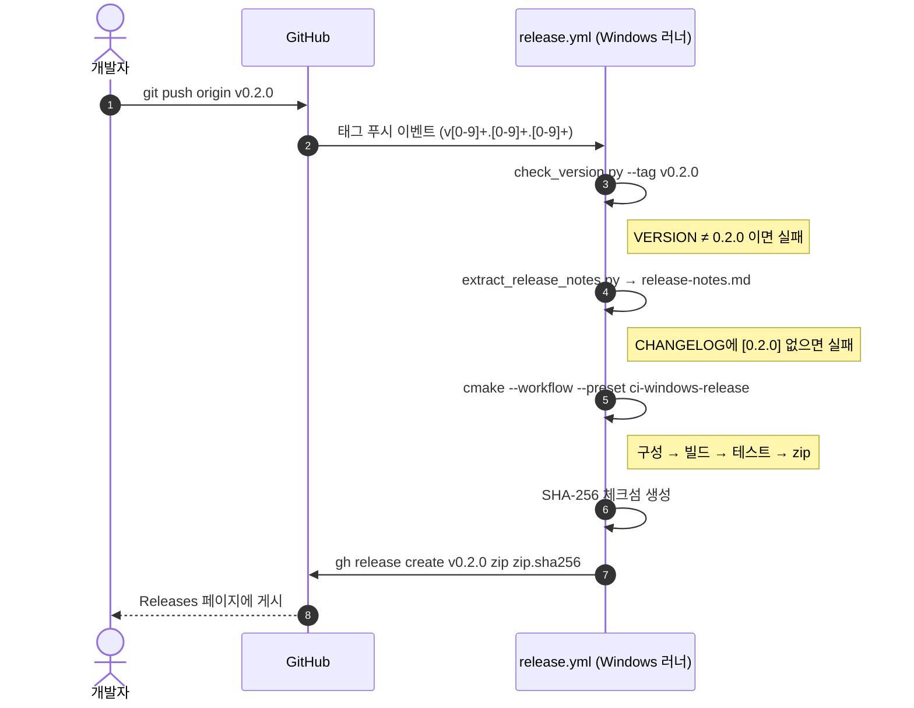

# CI/CD 구현 설명

| 항목 | 내용 |
|---|---|
| 문서 ID | DP-OPS-001 |
| 관련 ADR | [ADR-0006 빌드](../02-architecture/adr/0006-cmake-presets-ninja.md), [ADR-0007 CI/CD](../02-architecture/adr/0007-github-actions-ci.md) |
| 관련 요구사항 | FR-32, NFR-PORT-01, NFR-MAINT-02, NFR-MAINT-03, NFR-SEC-02 |

이 문서는 파이프라인이 **어떻게 만들어져 있는지**를 설명합니다. 빌드 방법·작업 흐름·릴리스 절차·문제 해결은 [CONTRIBUTING.md](../../CONTRIBUTING.md)를 보세요.

---

## 1. 설계 원칙

| 원칙 | 구현 |
|---|---|
| **로컬과 CI가 같은 명령** | CI는 `cmake --workflow --preset ci-*` 한 줄만 실행. 로컬에서 같은 명령으로 재현 가능 |
| **도구 버전 고정** | clang-format/clang-tidy는 `requirements-dev.txt`로, GoogleTest는 Git 태그로, Action은 메이저 버전으로 고정 |
| **빠른 실패 (Fail fast)** | 가장 싸고 빠른 `format` 잡이 통과해야 비싼 빌드 잡(특히 Windows)이 시작됨 |
| **최소 권한** | 기본 `contents: read`. 릴리스 잡만 `contents: write`, CodeQL만 `security-events: write` |
| **단일 원천** | 버전은 `VERSION` 파일 하나, 릴리스 노트는 `CHANGELOG.md` 하나에서 파생 |

## 2. 구성 파일 지도



| 파일 | 역할 |
|---|---|
| `VERSION` | 버전 번호 (예: `0.1.0`). CMake와 릴리스 스크립트가 읽음 |
| `CMakePresets.json` | 구성·빌드·테스트·패키지·워크플로 프리셋. 로컬과 CI가 공유 |
| `cmake/CompilerOptions.cmake` | 경고 수준, `/utf-8`, 경고=오류 옵션 |
| `cmake/Sanitizers.cmake` | ASan/UBSan (Linux CI) |
| `cmake/GitVersion.cmake` | Git 커밋 해시를 `Version.h`에 기록 |
| `cmake/Packaging.cmake` | `install()` 규칙과 CPack zip 설정 |
| `scripts/format.py` | clang-format 실행/검사 (버전 18 강제) |
| `scripts/run_clang_tidy.py` | 플랫폼 독립 소스에 clang-tidy 병렬 실행 |
| `scripts/check_version.py` | `VERSION` 형식 검사, 태그와 일치 검사 |
| `scripts/extract_release_notes.py` | `CHANGELOG.md`에서 버전 섹션 추출 |
| `.githooks/pre-commit` | 커밋 전 스테이징 파일 포맷 검사 |

## 3. 빌드 시스템: CMake Presets

### 3.1 프리셋 구조



- `condition`으로 OS별 프리셋을 숨깁니다. Linux에서는 Windows 프리셋이 목록에 나오지 않습니다.
- Windows는 **Ninja Multi-Config**라서 한 번 구성하고 Debug/Release를 모두 빌드할 수 있습니다.

### 3.2 워크플로 프리셋

`cmake --workflow --preset <이름>`은 아래 단계를 순서대로 실행하고, 하나라도 실패하면 멈춥니다.

| 워크플로 프리셋 | 구성 | 빌드 | 테스트 | 패키지 | 사용처 |
|---|---|---|---|---|---|
| `ci-linux` | `ci-linux` | ✅ | ✅ | — | CI `linux` 잡 |
| `ci-windows-debug` | `ci-windows` | Debug | Debug | — | CI `windows (debug)` |
| `ci-windows-release` | `ci-windows` | Release | Release | ZIP | CI `windows (release)`, `release.yml` |
| `windows-release` | `windows-msvc` | Release | Release | ZIP | 로컬 |
| `linux-gcc` | `linux-gcc` | ✅ | ✅ | — | 로컬 |

### 3.3 테스트 실행

- `tests/CMakeLists.txt`가 GoogleTest v1.17.0을 `FetchContent`로 받아 빌드합니다 (인터넷 필요).
- `gtest_discover_tests`가 테스트 케이스 하나하나를 CTest 테스트로 등록하므로, 실패한 테스트 이름이 CI 로그에 바로 보입니다.
- 테스트 프리셋의 `noTestsAction: error` — 테스트가 0개로 발견되면(빌드 설정 실수) 실패로 처리합니다.

### 3.4 버전 정보 주입



## 4. `ci.yml` — 지속적 통합

### 4.1 트리거와 공통 설정

```yaml
on:
  push: { branches: [main] }     # main에 머지된 결과도 검증
  pull_request:                   # 모든 PR
  workflow_dispatch:              # 수동 실행 버튼
permissions: { contents: read }   # 최소 권한
concurrency:                      # 같은 브랜치의 이전 실행 취소
  group: ci-${{ github.workflow }}-${{ github.ref }}
  cancel-in-progress: true
```

### 4.2 잡 구성



| 잡 | 러너 | 하는 일 | 잡아내는 문제 | 요구사항 |
|---|---|---|---|---|
| `format` | ubuntu-24.04 | `check_version.py`, `format.py --check` | 포맷 위반, 잘못된 VERSION | NFR-MAINT-03 |
| `lint` | ubuntu-24.04 | `cmake --preset linux-gcc` → `run_clang_tidy.py` | 버그 패턴, 성능 낭비, 명명 규칙 위반 | NFR-MAINT-01 |
| `linux` | ubuntu-24.04 | `cmake --workflow --preset ci-linux` | 플랫폼 의존성 누수(Windows 헤더 include), 메모리 오류, 정의되지 않은 동작, GCC 경고 | NFR-PORT-01, NFR-MAINT-02 |
| `windows` ×2 | windows-latest | `cmake --workflow --preset ci-windows-{debug,release}` | MSVC 경고(/W4 /WX), Windows 빌드·링크 오류, 테스트 실패 | NFR-MAINT-02 |

#### 왜 Linux에서도 빌드하나?

`core`, `character`, `app`은 Windows API를 쓰면 안 된다는 설계 규칙(SAD R2)이 있습니다. 사람이 리뷰로 지키기는 어렵지만, Linux에서 빌드하면 `<windows.h>`를 include 하는 순간 컴파일이 실패하므로 **규칙이 자동으로 강제**됩니다. 덤으로 ASan/UBSan(Windows MSVC보다 강력한 런타임 검사)으로 테스트를 돌릴 수 있습니다.

#### Windows 잡의 MSVC 환경

```yaml
- run: pip install ninja                  # Ninja 설치 (Python 패키지로 배포됨)
- uses: ilammy/msvc-dev-cmd@v1            # 개발자 명령 프롬프트와 같은 환경 변수 설정
  with: { arch: x64 }
- run: cmake --workflow --preset ci-windows-release
```

Ninja 생성기는 `cl.exe`와 Windows SDK 경로가 환경 변수에 있어야 동작합니다. 로컬에서 "x64 Native Tools Command Prompt"를 여는 것과 같은 일을 `msvc-dev-cmd`가 합니다.

### 4.3 아티팩트

| 아티팩트 | 조건 | 보관 |
|---|---|---|
| `DeskPet-win64-<커밋 SHA>` (zip) | Windows Release 잡 성공 시 | 14일 |
| `*-test-logs` | 잡 실패 시 | 7일 |

PR마다 실제로 실행해 볼 수 있는 zip이 만들어지므로, 머지 전에 Windows에서 직접 확인할 수 있습니다.

## 5. `release.yml` — 지속적 배포



| 안전장치 | 목적 |
|---|---|
| 태그 패턴 `v[0-9]+.[0-9]+.[0-9]+` | `v1.0-test` 같은 실수 태그로는 실행되지 않음 |
| `check_version.py` | 태그와 실행 파일 안의 버전이 다른 릴리스 방지 |
| `extract_release_notes.py` | 변경 내역 없는 릴리스 방지 (CHANGELOG 작성 강제) |
| 릴리스 전에 테스트 재실행 | 태그된 커밋이 실제로 테스트를 통과하는지 확인 |
| `.sha256` 체크섬 | 다운로드 파일 무결성 확인 |
| `--verify-tag` | 원격에 태그가 실제로 있는 경우에만 릴리스 생성 |
| `concurrency.cancel-in-progress: false` | 릴리스 도중 취소되어 반쪽짜리 릴리스가 생기는 것 방지 |

`GH_TOKEN: ${{ github.token }}`은 GitHub이 워크플로마다 자동으로 발급하는 임시 토큰입니다. 별도의 시크릿 등록이 필요 없습니다.

## 6. `codeql.yml` — 보안 정적 분석

- GitHub의 CodeQL이 코드를 데이터베이스로 바꾼 뒤 "신뢰할 수 없는 입력이 버퍼 크기 계산에 쓰인다" 같은 패턴을 질의로 찾아냅니다.
- `build-mode: manual` — CodeQL이 우리의 실제 빌드(`cmake --build`)를 관찰해 Windows 전용 코드까지 분석합니다.
- 결과는 저장소 **Security → Code scanning**에 표시되고, PR에는 새로 생긴 경고만 주석으로 달립니다.
- 매주 월요일에 다시 돌려 새로 추가된 분석 규칙을 적용합니다.
- 공개 저장소는 무료입니다. 비공개 저장소는 GitHub Advanced Security가 필요하므로, 비공개로 운영한다면 이 워크플로를 삭제하거나 `workflow_dispatch`만 남기세요.

## 7. `dependabot.yml` — 의존성 업데이트

| 대상 | 주기 | 동작 |
|---|---|---|
| GitHub Actions (`actions/checkout@v5` 등) | 매주 월요일 | 새 메이저 버전이 나오면 PR 1개로 묶어 생성 |
| pip (`requirements-dev.txt`) | 매월 | clang-format/tidy의 **메이저** 업데이트는 무시 (포맷 결과가 바뀌므로 사람이 판단) |

Dependabot PR도 일반 PR처럼 CI를 거치므로, 초록색이면 머지하면 됩니다.

## 8. 로컬 단계: pre-commit 훅

```bash
git config core.hooksPath .githooks   # 한 번만
```

커밋할 때마다 `.githooks/pre-commit`이 스테이징된 C++ 파일만 `clang-format --dry-run --Werror`로 검사합니다. CI의 `format` 잡에서 떨어지기 전에 몇 초 만에 알려 줍니다. clang-format이 설치되어 있지 않으면 경고만 하고 넘어갑니다.

## 9. 보안 고려 사항

| 항목 | 적용 |
|---|---|
| 워크플로 권한 | 기본 `read`, 필요한 잡에만 쓰기 권한 |
| 포크 PR | GitHub 기본 정책상 포크에서 온 PR은 쓰기 토큰·시크릿을 받지 못함 (`pull_request` 트리거 사용, `pull_request_target` 미사용) |
| 서드파티 Action | `ilammy/msvc-dev-cmd` 하나만 사용. 더 엄격하게 하려면 태그 대신 **커밋 SHA로 고정**하고 Dependabot이 갱신하게 함 (§10) |
| 시크릿 | 사용하지 않음 (`github.token`만 사용) |

## 10. 개선 과제 (학습용)

난이도 순으로 정리했습니다. 하나씩 PR로 추가해 보세요.

| 과제 | 내용 | 배우는 것 |
|---|---|---|
| 빌드 캐시 | `actions/cache`로 `build/*/_deps`(GoogleTest) 캐시, 또는 `sccache` | 캐시 키 설계, 캐시 무효화 |
| 테스트 결과 리포트 | `ctest --output-junit` → PR에 테스트 요약 표시 | JUnit XML, 체크 요약 |
| 코드 커버리지 | Linux 잡에 `--coverage` + `gcovr` → 커버리지 배지 | 커버리지 측정과 한계 |
| Action SHA 고정 | `uses: actions/checkout@<40자 SHA> # v5` | 공급망 보안 |
| 브랜치 보호 자동화 | 필수 체크 목록을 문서 대신 설정으로 관리 | 저장소 설정 관리 |
| 렌더링 스냅샷 테스트 | WARP 디바이스로 오프스크린 렌더 → 기준 PNG와 비교 (M2) | 그래픽스 회귀 테스트 |
| 코드 서명 | 릴리스 exe에 서명 (Azure Trusted Signing 등) | 배포 신뢰성, SmartScreen |
| 릴리스 노트 자동화 | Conventional Commits에서 CHANGELOG 생성 (release-please 등) | 커밋 규칙의 활용 |
