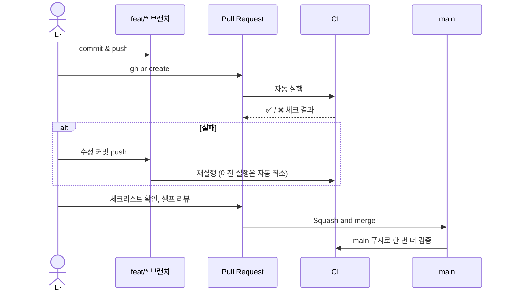
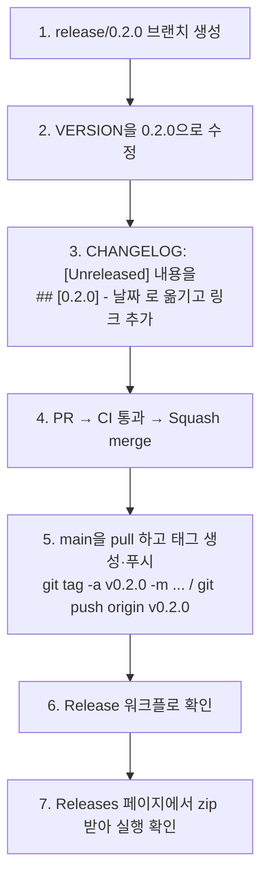

# CI/CD 사용 가이드

| 항목 | 내용 |
|---|---|
| 문서 ID | DP-OPS-002 |
| 대상 | 저장소를 GitHub에 올리고, PR을 만들고, 릴리스를 배포하는 사람 |

구현 원리는 [ci-cd-implementation.md](ci-cd-implementation.md)를 보세요. 이 문서는 **따라 하기** 위주입니다.

---

## 1. 준비물

| 도구 | 용도 | 확인 명령 |
|---|---|---|
| Git | 버전 관리 | `git --version` |
| GitHub 계정 | 저장소, Actions | — |
| GitHub CLI `gh` (권장) | 저장소·PR·릴리스를 명령줄에서 | `gh --version`, 로그인: `gh auth login` |

## 2. 저장소 만들고 첫 푸시

### 2.1 `OWNER` 바꾸기

`README.md`의 배지와 `CHANGELOG.md` 하단 링크에 있는 `OWNER`를 본인 GitHub 사용자 이름으로 바꿉니다. 편집기의 "찾아 바꾸기"를 쓰거나, Git Bash에서:

```bash
sed -i 's/OWNER/내아이디/g' README.md CHANGELOG.md
```

> Windows PowerShell 5.1의 `Set-Content`는 기본 인코딩이 UTF-8이 아니어서 한글이 깨질 수 있습니다. 편집기나 Git Bash를 권장합니다.

`LICENSE`의 저작권자 이름도 원하면 바꿉니다.

### 2.2 Git 초기화와 푸시

```bash
git init -b main
git config core.hooksPath .githooks          # pre-commit 훅 켜기
git add .
git commit -m "chore: initial project skeleton (M0)"

# 방법 A: GitHub CLI
gh repo create deskpet --public --source=. --remote=origin --push

# 방법 B: 웹에서 빈 저장소(README 없이)를 만든 뒤
git remote add origin https://github.com/ChoHye0N/TinyDeskPet.git
git push -u origin main
```

> **공개(public)를 권장하는 이유**: 공개 저장소는 표준 러너의 Actions 사용량과 CodeQL이 무료입니다. 비공개 저장소는 월간 무료 사용량이 있고, Windows 러너는 Linux보다 사용량을 더 많이 차감합니다. 정확한 요금 정책은 바뀔 수 있으니 GitHub Billing 문서를 확인하세요.

## 3. 첫 CI 실행 확인

1. 저장소 페이지 → **Actions** 탭
2. `CI`, `CodeQL` 워크플로가 실행 중(노란 원)인지 확인
3. `CI` 실행을 클릭하면 잡 그래프가 보입니다: `format` → `lint`, `linux`, `windows (debug)`, `windows (release)`
4. 잡을 클릭하면 단계별 로그가 펼쳐집니다
5. 모두 초록색이 되면, 실행 요약 페이지 하단 **Artifacts**에서 `DeskPet-win64-<SHA>`를 내려받아 실행해 봅니다

| 조작 | 방법 |
|---|---|
| 실패한 잡만 다시 실행 | 실행 페이지 오른쪽 위 **Re-run jobs → Re-run failed jobs** |
| 수동 실행 | Actions → CI → **Run workflow** (`workflow_dispatch` 덕분) |
| 로그 다운로드 | 실행 페이지 ⋯ 메뉴 → **Download log archive** |
| CLI로 보기 | `gh run list`, `gh run watch`, `gh run view --log-failed` |

## 4. `main` 보호와 PR 흐름

### 4.1 브랜치 보호 규칙 설정 (한 번만)

CI가 통과하지 않은 코드가 `main`에 들어가지 못하게 막습니다. **CI가 한 번 이상 실행된 뒤에** 설정해야 체크 이름이 목록에 나타납니다.

**Settings → Rules → Rulesets → New ruleset → New branch ruleset**

| 항목 | 값 |
|---|---|
| Ruleset name | `protect-main` |
| Enforcement status | **Active** |
| Target branches | **Add target → Include default branch** |
| Restrict deletions | ✅ |
| Block force pushes | ✅ |
| Require linear history | ✅ (Squash merge만 사용) |
| Require a pull request before merging | ✅ (혼자라면 Required approvals는 **0**) |
| Require status checks to pass | ✅ → **Add checks**에서 아래 5개 추가 |

필수 상태 체크:

- `Format & Hygiene`
- `Static Analysis (clang-tidy)`
- `Linux (GCC, ASan+UBSan)`
- `Windows (MSVC, debug)`
- `Windows (MSVC, release)`

그리고 **Settings → General → Pull Requests**에서 **Allow squash merging**만 켜고, **Automatically delete head branches**를 켭니다.

### 4.2 PR 만들기

```bash
git switch -c feat/throw-velocity
# ... 코드 수정 ...
python scripts/format.py
git add -A
git commit -m "feat(character): 놓는 순간의 드래그 속도로 던지기 구현"
git push -u origin feat/throw-velocity
gh pr create --fill          # 또는 웹에서 "Compare & pull request"
```

PR 페이지 하단에 체크 목록이 나타나고, 모두 통과해야 **Squash and merge** 버튼이 활성화됩니다.



### 4.3 실습: CI가 막는 것을 직접 보기

1. 브랜치를 만들고 `src/core/Math.h`의 들여쓰기를 일부러 망가뜨려 커밋합니다 (`git commit --no-verify`로 훅을 건너뜀).
2. PR을 만들면 `Format & Hygiene`이 ❌가 되고 나머지 잡은 시작조차 하지 않습니다 (빠른 실패).
3. `python scripts/format.py`로 고쳐 푸시하면 ✅로 바뀝니다.
4. 다음으로 `src/character/CharacterController.cpp`에 `#include <windows.h>`를 넣어 보세요. Windows 잡은 통과하지만 **Linux 잡이 실패**합니다 → 플랫폼 독립 규칙이 자동으로 지켜지는 원리입니다.

## 5. 릴리스 만들기

### 5.1 첫 릴리스 (v0.1.0)

`VERSION`과 `CHANGELOG.md`에 이미 `0.1.0`이 준비되어 있으므로 태그만 푸시하면 됩니다.

```bash
git switch main && git pull
git tag -a v0.1.0 -m "DeskPet 0.1.0"
git push origin v0.1.0
```

Actions 탭에서 `Release` 워크플로가 끝나면 **Releases** 페이지에 `DeskPet-0.1.0-win64.zip`과 `.sha256`이 올라갑니다.

### 5.2 이후 릴리스 절차



`CHANGELOG.md` 예시:

```markdown
## [Unreleased]

## [0.2.0] - 2026-11-15

### Added
- 던지기 (FR-16)
- 시스템 트레이 아이콘 (FR-18)

[Unreleased]: https://github.com/ChoHye0N/TinyDeskPet/compare/v0.2.0...HEAD
[0.2.0]: https://github.com/ChoHye0N/TinyDeskPet/compare/v0.1.0...v0.2.0
```

### 5.3 릴리스가 실패했을 때

| 실패 단계 | 원인 | 해결 |
|---|---|---|
| Verify tag matches VERSION | 태그와 `VERSION`이 다름 | 아래 "태그 다시 만들기" |
| Extract release notes | CHANGELOG에 해당 버전 섹션이 없음 | CHANGELOG 수정 PR → 머지 → 태그 다시 만들기 |
| Configure, build, test, package | 태그된 커밋이 빌드/테스트 실패 | 수정 PR → 머지 → 태그 다시 만들기 |
| Create GitHub Release | 같은 이름의 릴리스가 이미 있음 | Releases에서 기존 릴리스 삭제 후 워크플로 Re-run |

태그 다시 만들기:

```bash
git tag -d v0.2.0                      # 로컬 태그 삭제
git push --delete origin v0.2.0        # 원격 태그 삭제
git switch main && git pull            # 수정이 반영된 main
git tag -a v0.2.0 -m "DeskPet 0.2.0"
git push origin v0.2.0
```

> 이미 다른 사람이 받아 간 릴리스의 태그는 바꾸지 않는 것이 원칙입니다. 그때는 `v0.2.1`로 새 릴리스를 냅니다.

## 6. CI가 실패했을 때

먼저 **로컬에서 같은 명령으로 재현**합니다.

| 실패한 잡 | 로컬 재현 명령 |
|---|---|
| Format & Hygiene | `python scripts/format.py --check` |
| Static Analysis | (Linux/WSL) `cmake --preset linux-gcc` → `python scripts/run_clang_tidy.py --build-dir build/linux-gcc` |
| Linux | (Linux/WSL) `cmake --workflow --preset ci-linux` |
| Windows (debug/release) | (**x64** Native Tools 프롬프트) `cmake --workflow --preset ci-windows-debug` / `ci-windows-release` |

> Windows에서도 **WSL(Ubuntu 24.04)** 을 설치하면 Linux 잡을 그대로 재현할 수 있습니다: `sudo apt install g++ cmake ninja-build python3-pip`

자주 보는 실패:

| 증상 (로그) | 원인 | 해결 |
|---|---|---|
| `clang-format ... code should be clang-formatted [-Wclang-format-violations]` | 포맷 위반 | `python scripts/format.py` 후 커밋 |
| `error: ... [readability-identifier-naming,-warnings-as-errors]` | 명명 규칙 위반 | 메시지대로 이름 수정. 정당한 예외면 해당 줄에 `// NOLINT(검사이름): 이유` |
| Linux: `fatal error: windows.h: No such file or directory` | 플랫폼 독립 모듈에서 Windows 헤더 사용 | 해당 코드를 `platform/win32` 또는 `renderer/d3d11`로 이동 |
| Linux: `ERROR: AddressSanitizer: heap-use-after-free` | 해제된 메모리 사용 | 로그의 스택 트레이스(파일:줄)를 따라가 수명 문제 수정 |
| Linux: `runtime error: signed integer overflow` | UBSan이 정의되지 않은 동작 감지 | 타입 범위 검토 |
| Windows: `error C2220: the following warning is treated as an error` | `/WX`로 경고가 오류가 됨 | 바로 위 줄의 실제 경고(C4xxx)를 수정 |
| `No tests were found!!!` | 테스트 실행 파일이 빌드되지 않았거나 등록 실패 | `tests/CMakeLists.txt`에 새 파일을 추가했는지 확인 |
| `FetchContent ... Failed to clone` | 일시적 네트워크 문제 | Re-run failed jobs |
| `Could not find Ninja` / `cl is not a full path` | MSVC/Ninja 환경 미설정 | 워크플로 순서(pip install ninja → msvc-dev-cmd) 확인. 로컬은 개발자 명령 프롬프트 사용 |
| (로컬) Debug 실행 중·종료 시 `Run-Time Check Failure #2 - Stack around the variable ... was corrupted`, 헤더를 고쳤는데 반영 안 됨 | 한국어 MSVC의 `/showIncludes` 머리말이 콘솔 코드 페이지(949/65001)마다 바이트가 달라, configure와 다른 셸에서 빌드하면 Ninja가 헤더 의존성을 0개로 기록 → 헤더가 바뀌어도 일부 `.cpp`가 재컴파일되지 않아 객체 크기가 어긋남. configure 때 경고가 뜸 | 당장: `cmake --build --preset <이름> --clean-first`. 근본: VS Installer > 언어 팩 > **영어** 설치 후 **x64 Native Tools 프롬프트**에서 `cmake --preset <이름> --fresh` (프리셋이 `VSLANG=1033`을 넣어 머리말이 ASCII가 됨) |
| (로컬) 링크 오류 `unresolved external symbol ... __stdcall` / `__thiscall` / `__purecall`, 또는 configure가 `64비트 MSVC가 아닙니다`로 멈춤 | 일반 "Developer Command Prompt"(기본 x86)에서 configure → 32비트 컴파일러가 캐시에 고정되고 x64 셸 빌드와 섞임. 프리셋의 `architecture: x64`(strategy external)는 검사하지 않음 | **x64 Native Tools Command Prompt for VS**(또는 `vcvars64.bat`)에서 `cmake --preset <이름> --fresh` → `cmake --build --preset <이름> --clean-first` |

## 7. 기타 자동화 사용법

### Dependabot PR

- 매주 월요일 `ci: bump ...` PR이 열릴 수 있습니다. CI가 통과하면 머지합니다.
- 메이저 업데이트로 CI가 깨지면 변경 내역(PR 본문의 Release notes)을 보고 워크플로를 고친 커밋을 같은 PR에 추가합니다.

### CodeQL 경고

- **Security → Code scanning**에서 경고 목록을 봅니다.
- 실제 문제면 수정 PR을 만들고, 오탐이면 **Dismiss alert → False positive**와 이유를 남깁니다 (기록이 남는 것이 중요).

### 상태 배지

`README.md` 상단 배지는 `OWNER`를 바꾸면 바로 동작합니다. 포트폴리오를 보는 사람이 **빌드가 항상 초록색**인 것을 첫 화면에서 확인할 수 있습니다.
