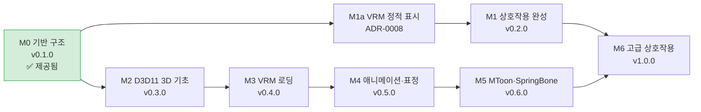

# 로드맵

| 항목 | 내용 |
|---|---|
| 문서 ID | DP-RMP-001 |
| 버전 | 0.1.0 |

각 마일스톤은 **끝까지 동작하는 상태**로 마무리합니다 (중간에 빌드가 깨진 채로 다음 단계로 가지 않음). 마일스톤이 끝나면 버전을 올리고 태그를 푸시해 릴리스합니다.

## 마일스톤 의존 관계

코드에서 각 과제는 `TODO(M번호)` 주석으로 표시되어 있습니다. 찾기: `git grep -n "TODO(M1)"`

---

## M0 — 기반 구조 (v0.1.0) ✅ 제공

| 과제 | 상태 |
|---|---|
| 설계 문서 (SRS, SAD, ADR, 상세 설계) | ✅ |
| CMake + Presets 빌드 구조, 플랫폼 독립 모듈 분리 | ✅ |
| DirectComposition 투명 창, D3D11 디바이스·스왑체인, 디바이스 손실 복구 | ✅ |
| 플레이스홀더 캐릭터 (숨쉬기, 깜빡임, 착지 반동) | ✅ |
| 드래그, 낙하, 점프, 컨텍스트 메뉴, 클릭 통과(도형) | ✅ |
| 설정 파일, 로그, 버전 정보 | ✅ |
| 단위 테스트 (core, character, app) | ✅ |
| CI/CD (포맷, Linux, Windows, CodeQL, 릴리스, Dependabot) | ✅ |

**첫 번째로 할 일**: Windows에서 빌드·실행해 보고 [SRS §6 인수 기준](../01-requirements/SRS.md#6-인수-기준-m0)을 직접 확인한 뒤, GitHub에 올려 CI가 도는 것을 확인하세요. 측정값(CPU, 메모리)을 아래 측정 기록에 남기세요.

## M1a — VRM 정적 표시 ([ADR-0008](../02-architecture/adr/0008-vrm-before-interaction.md))

목표: 슬라임 대신 공개 VRM 모델(Seed-san)을 투명 배경에 띄웁니다. M2·M3의 최소 범위를 앞당긴 것입니다.

| 과제 | 모듈 | 상태 |
|---|---|---|
| `Math3D.h` (행 벡터 규약, lookAt/원근 투영) | core | ✅ |
| cgltf로 VRM 0.x/1.0 로딩, 바인드 포즈 CPU 스키닝, 0.x 방향 보정 | model | ✅ |
| HLSL → `fxc /Fh` 빌드 시 컴파일 | renderer | ✅ |
| `MeshPass` (깊이, premultiplied alpha, 2단 툰), WIC 텍스처 + 밉맵 | renderer | ✅ |
| 경계 상자 맞춤 카메라, 모델 클릭 영역, `[model] path` 설정 | app, core | ✅ |
| Seed-san으로 실제 실행 확인, 측정값 기록 | — | ✅ |
| 텍스처 긴 변 512로 축소 디코딩 (메모리 169MB → 101MB) | renderer | ✅ |
| 메모리 목표 확인: NFR-PERF-02의 "VRM 로드 후 200MB 미만"을 101MB로 충족 | — | ✅ |

남은 M2/M3 항목: WARP 스냅샷 테스트(M2), VRM 메타·휴머노이드 본(M3), 선형 색공간(M5).

### M1b — 다중 모델 형식 ([ADR-0009](../02-architecture/adr/0009-multiple-model-formats.md))

| 과제 | 상태 |
|---|---|
| 형식 판별(매직 바이트) + 형식별 로더 구조, 공통 규약(미터·오른손·정면 +Z·CCW·UV 왼쪽 위) | ✅ |
| PMX 2.0/2.1 로더 (직접 구현: UTF-16, 가변 인덱스, 본 플래그별 가변 필드) | ✅ |
| FBX 로더 (ufbx: 축·단위 변환, 다각형 삼각화, 내장/외부 텍스처) | ✅ |
| 외부 텍스처 파일, TGA 디코딩(stb_image) | ✅ |
| 휴머노이드 본 이름 통일 (VRM humanBones / MMD 표준 본 / Mixamo) — M4 애니메이션의 기반 | ✅ |
| 실제 모델 확인: VRM(Seed-san), FBX(ufbx 테스트 데이터 Kenney 캐릭터) | ✅ |
| 실제 PMX 모델로 확인 | ⬜ (사용자 모델 필요) |

## M1 — 상호작용 완성 (v0.2.0)

목표: 2D 플레이스홀더 상태에서 "펫다운" 동작을 완성합니다. DirectX를 건드리지 않고 도메인 로직과 Win32에 집중합니다.

| 과제 | 모듈 | 요구사항 | 학습 포인트 | 상태 |
|---|---|---|---|---|
| 던지기 (드래그 속도 → 관성, 마찰) | character | FR-16 | 수치 적분, 링 버퍼 | ✅ |
| 화면 좌우 경계 처리 | character, app | FR-17 | 가상 데스크톱 좌표 (`SM_XVIRTUALSCREEN`) | ✅ |
| 시스템 트레이 아이콘 (표시/숨기기/종료) | platform | FR-18 | `Shell_NotifyIconW`, 메시지 기반 UI | ✅ |
| 단일 인스턴스 | app | FR-19 | 이름 있는 커널 객체 | ✅ |
| DPI 배율 반영 | platform, app | DEBT-01 | `GetDpiForWindow`, `WM_DPICHANGED` | ✅ |
| 변화 없을 때 Present 생략 | renderer | DEBT-02 | 프레임 페이싱, 전력 측정 | ✅ |
| 걷기 상태 (좌우로 천천히 이동) | character | — | 상태 머신 확장 | ✅ |
| 마지막 위치 저장 | core, app | — | 설정 쓰기 | ✅ |
| 로그 파일 회전·크기 제한 | core | — | 파일 시스템 | ✅ |

남은 확인: CI(특히 Linux) 통과, 버전 0.2.0 태그.

**완료 기준**: 새 기능 단위 테스트 추가, CI 통과, CPU 측정값이 M0보다 나빠지지 않음.

## M2 — D3D11 3D 기초 (v0.3.0)

목표: Direct2D 플레이스홀더 옆에 D3D11로 직접 그린 3D 오브젝트를 투명 배경에 띄웁니다.

| 과제 | 학습 포인트 |
|---|---|
| HLSL 빌드 파이프라인 (`shaders/` → CMake에서 `fxc`/`dxc` 컴파일) | 셰이더 모델, 빌드 의존성 |
| `MeshPass`: 정점·인덱스 버퍼, 입력 레이아웃 | 입력 어셈블러 |
| 카메라 상수 버퍼, 원근 투영 (DirectXMath) | 좌표 변환, 행/열 우선 |
| 깊이 버퍼 | 깊이 테스트 |
| premultiplied alpha 출력과 블렌드 상태 | 투명 합성 원리 |
| 회전하는 큐브 / 조명(램버트) | 기본 셰이딩 |
| (선택) WARP 오프스크린 스냅샷 테스트를 CI에 추가 | 그래픽스 회귀 테스트 |

**완료 기준**: 큐브의 가장자리가 바탕화면과 자연스럽게 섞이고(검은 테두리 없음), 디바이스 손실 후에도 다시 그려짐.

## M3 — VRM 로딩 (v0.4.0)

| 과제 | 학습 포인트 |
|---|---|
| `cgltf`로 glTF 바이너리(.vrm) 로드 | glTF 구조 (buffer → bufferView → accessor) |
| 메시·머티리얼·텍스처 GPU 업로드 | 텍스처 포맷, sRGB, 밉맵 |
| VRM 0.x / 1.0 확장 파싱, 내부 표현 통일 | JSON 확장, 버전 호환 |
| 라이선스 메타데이터 표시 | — |
| 로딩을 작업 스레드로 분리 | 스레드 간 데이터 전달 |
| 정적 포즈(T-포즈)로 렌더링 | — |

## M4 — 애니메이션·표정 (v0.5.0)

계획 A(코드로 계산하는 동작)를 먼저 진행했습니다 — [ADR-0010](../02-architecture/adr/0010-procedural-animation.md), [anim.md](../03-detailed-design/anim.md).

| 과제 | 학습 포인트 | 상태 |
|---|---|---|
| 노드 계층 변환, 휴머노이드 본 매핑 | 행렬 계층 | ✅ (ADR-0009) |
| GPU 스키닝 (본 행렬 → 버텍스 셰이더) | 스키닝 수학, 구조화 버퍼 | ✅ |
| 모프 타깃(BlendShape)으로 표정·눈 깜빡임 | 정점 블렌딩 | ✅ 깜빡임·기쁨·놀람 (VRM, PMX) |
| 절차적 동작: 팔 내림, 대기, 걷기, 매달림, 공중, 착지 | 쿼터니언, FK | ✅ |
| character `Pose` → 애니메이션 파라미터 연결 | 도메인과 렌더링 분리 유지 | ✅ |
| 상태 전환 시 자세 보간 (0.2초) | slerp | ✅ |
| 모션 파일 재생: VRMA / VMD / FBX | 키프레임 보간, 리타기팅 | ⬜ |

## M5 — MToon·SpringBone (v0.6.0)

| 과제 | 학습 포인트 |
|---|---|
| MToon 셰이더 (쉐이드 색, 림 라이트, MatCap) | 툰 셰이딩 |
| 아웃라인 (반전 헐) | 멀티 패스 |
| SpringBone (머리카락·옷) | Verlet 적분, 충돌체 |
| 알파 기반 클릭 통과 (FR-04 고도화) | GPU → CPU 읽기(스테이징 텍스처) 비용 관리 |

## M6 — 고급 상호작용 (v1.0.0)

| 과제 | 학습 포인트 |
|---|---|
| 마우스 커서 바라보기 (LookAt) | 본 회전 제한 |
| 다른 창 위를 걷기 | `EnumWindows`, DWM 프레임 경계 |
| (선택) 대화 기능: LLM API + TTS + 립싱크 | 비동기 I/O, 오디오 |
| (선택) macOS 백엔드 (Metal) | 플랫폼 추상화 검증 |

---

## 측정 기록

마일스톤마다 같은 조건(창 200×200, 대기 상태 60초)으로 측정해 기록합니다. 포트폴리오에서 "최적화했다"를 숫자로 보여 주는 근거가 됩니다.

| 버전 | 날짜 | 환경 (CPU / GPU / 해상도·주사율) | CPU 평균 | 작업 집합 | GPU 사용률 | 비고 |
|---|---|---|---|---|---|---|
| 0.1.0 | 2026-10-01 | (이 PC) / — / — | — | 52MB | — | 플레이스홀더, Release, 320×340 창, 15초 간이 측정 |
| M1a | 2026-10-01 | (이 PC) / — / — | 0.12% | 101MB | — | Seed-san, Release, 320×340, 15초 간이 측정. 텍스처 512 제한 전 169MB |
| M1 | 2026-10-01 | (이 PC) / — / — | 0.12% | 100MB | (정정) | Seed-san, Release. 당시 "대기 중 GPU 0%"로 기록했으나, 숨긴 슬라임의 숨쉬기 값이 장면을 바꿔 실제로는 Present 생략이 동작하지 않았음 (M4에서 수정) |
| M4 (계획 A) | 2026-10-01 | (이 PC) / — / — | 0.17% / 0.04% | 103MB | 1.6% / 0% | Seed-san, Release, 대기 동작 켬 / 끔(`idle_motion = false`). 15초 간이 측정 |
